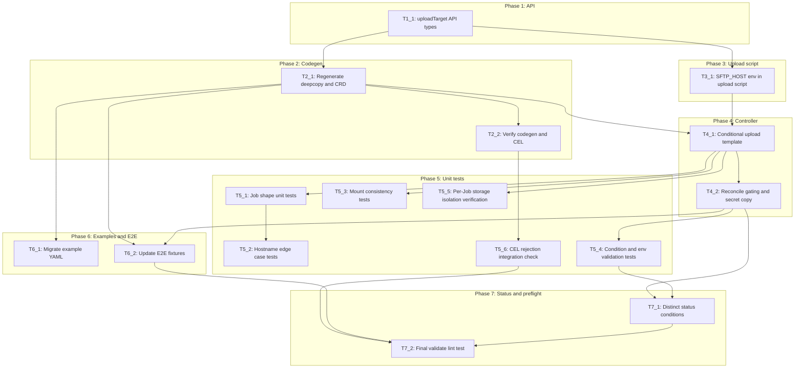

# Execution Backlog

**Feature:** MG-53 — Extensible Must-Gather Upload Targets  
**AgentRoutingMode:** PROVISIONAL  
**ConstitutionVersion:** 1.0.0

## 0. Input coverage checklist

- **FR-001** (SFTP upload destination type) → T1_1, T4_1, T5_1
- **FR-002** (optional SFTP hostname, default production) → T3_1, T4_1, T5_2, T6_1
- **FR-003** (caseID + secret required for SFTP) → T1_1, T4_1
- **FR-004** (reject invalid type/settings mismatch) → T1_1, T2_2, T5_6
- **FR-005** (internalUser indicator) → T1_1, T4_1, T5_1
- **FR-006** (skip upload when unset) → T4_1, T4_2, T5_1, T6_2
- **FR-007** (grouped upload destination block) → T1_1
- **FR-008** (breaking change, no legacy fields) → T1_1, T6_1, T6_2
- **FR-009** (surface upload failures) → T7_1, T5_4
- **FR-010** (SFTP-only types) → T1_1, T2_2
- **SC-001** (staging hostname upload) → T3_1, T4_1, T5_2, T6_1, manual in T7_2
- **SC-002** (default hostname) → T3_1, T5_2
- **SC-003** (invalid config rejected) → T2_2, T5_6
- **SC-004** (no upload when unset) → T4_1, T5_1, T6_2
- **SC-005** (upload failure observable) → T7_1, T5_4
- **SC-006** (legacy CR rejected post-upgrade) → T6_1, T2_2
- **Plan Phase 1** (API schema) → T1_1
- **Plan Phase 2** (codegen) → T2_1, T2_2
- **Plan Phase 3** (upload script) → T3_1
- **Plan Phase 4** (controller/template) → T4_1, T4_2
- **Plan Phase 5** (unit tests) → T5_1–T5_6
- **Plan Phase 6** (examples/E2E) → T6_1, T6_2
- **Plan Phase 7** (env validation + conditions) → T7_1, T5_4
- **PVC isolation (deferred)** → T5_5 (emptyDir per-Job verification; PVC multi-run isolation documented as out-of-scope)

## 1. Task Dependency Graph (Mermaid)

## 2. Linear Execution Order (Chronological)

1. - [x] T1_1 — Define uploadTarget API types and CEL validation
2. - [x] T2_1 — Regenerate deepcopy, OpenAPI, CRD, and bundle
3. - [x] T3_1 — Add SFTP_HOST env support to upload script
4. - [x] T2_2 — Verify codegen output and CEL rules in CRD
5. - [x] T4_1 — Implement conditional upload in Job template
6. - [x] T4_2 — Update reconcile flow for optional upload
7. - [x] T5_1 — Unit tests for Job shapes (one vs two containers)
8. - [x] T5_3 — Unit tests for gather/upload mount consistency
9. - [x] T5_2 — Unit tests for SFTP hostname edge cases
10. - [x] T5_5 — Verification: per-Job emptyDir isolation (PVC deferred)
11. - [x] T7_1 — Implement distinct status condition types and env fail-fast
12. - [x] T5_4 — Unit tests for condition types and empty env validation
13. - [x] T5_6 — Integration check: invalid uploadTarget rejected at admission
14. - [x] T6_1 — Migrate example YAML to uploadTarget structure
15. - [x] T6_2 — Update E2E test fixtures and CR construction
16. - [x] T7_2 — Final preflight: make validate, lint, go-test

## 3. Task Execution Manifest

| Task ID | Task Title | Assigned Agent | Phase | Depends On | Parallel OK | Complexity | Risk |
|---------|-----------|---------------|-------|-----------|------------|-----------|------|
| T1_1 | Define uploadTarget API types and CEL validation | API_Agent | Phase 1 | none | No | 5 | Med |
| T2_1 | Regenerate deepcopy, OpenAPI, CRD, and bundle | ManifestsBindata_Agent | Phase 2 | T1_1 | No | 2 | Low |
| T2_2 | Verify codegen output and CEL rules | Testing_Agent | Phase 2 | T2_1 | Yes | 2 | Low |
| T3_1 | Add SFTP_HOST env to upload script | OperatorController_Agent | Phase 3 | T1_1 | Yes | 2 | Low |
| T4_1 | Conditional upload in Job template | OperatorController_Agent | Phase 4 | T2_1, T3_1 | No | 5 | Med |
| T4_2 | Reconcile gating and optional secret copy | OperatorController_Agent | Phase 4 | T4_1 | No | 3 | Med |
| T5_1 | Unit tests: Job shapes (optional upload) | Testing_Agent | Phase 5 | T4_1 | Yes | 3 | Low |
| T5_2 | Unit tests: SFTP hostname edge cases | Testing_Agent | Phase 5 | T5_1 | Yes | 2 | Low |
| T5_3 | Unit tests: gather/upload mount consistency | Testing_Agent | Phase 5 | T4_1 | Yes | 2 | Low |
| T5_4 | Unit tests: distinct condition types and empty env | Testing_Agent | Phase 5 | T7_1 | No | 3 | Low |
| T5_5 | Verification: per-Job emptyDir isolation | Testing_Agent | Phase 5 | T4_1 | Yes | 2 | Low |
| T5_6 | Integration check: CEL rejects invalid uploadTarget | Testing_Agent | Phase 5 | T2_2 | Yes | 2 | Low |
| T6_1 | Migrate example YAML to uploadTarget | ManifestsBindata_Agent | Phase 6 | T2_1 | Yes | 2 | Low |
| T6_2 | Update E2E fixtures for new API | Testing_Agent | Phase 6 | T2_1, T4_2 | No | 3 | Med |
| T7_1 | Distinct status conditions and env fail-fast | OperatorController_Agent | Phase 7 | T4_2 | No | 3 | Med |
| T7_2 | Final preflight validate lint test | Testing_Agent | Phase 7 | T5_6, T6_2, T7_1, T5_4 | No | 2 | Low |

## 4. Task Specifications (Payloads)

### Task T1_1: Define uploadTarget API types and CEL validation

- **Objective:** Introduce `UploadTarget`, `SFTPUploadTargetConfig`, and remove legacy top-level upload fields per EP.
- **Target file(s):** `api/v1alpha1/mustgather_types.go`
- **Non-goals / forbidden edits:** Do not hand-edit `zz_generated.deepcopy.go`; do not change unrelated spec fields (audit, proxy, timeout).
- **Implementation notes:** Use kubebuilder union markers and field-level CEL with `has()` guards for omitempty members. Default `host` to `sftp.access.redhat.com`. API group remains `operator.openshift.io/v1alpha1`.
- **Acceptance criteria:** Types compile; CEL rule enforces SFTP type requires `sftp` block; FR-001, FR-004, FR-007, FR-008, FR-010 satisfied at type level.
- **Downstream handoff:** Frozen API shape for T2_1 codegen.

### Task T2_1: Regenerate deepcopy, OpenAPI, CRD, and bundle

- **Objective:** Regenerate all artifacts after API change per constitution Principle II.
- **Target file(s):** `api/v1alpha1/zz_generated.deepcopy.go`, `deploy/crds/operator.openshift.io_mustgathers.yaml`, `bundle/manifests/tech-preview/operator.openshift.io_mustgathers.yaml`
- **Non-goals / forbidden edits:** Do not hand-edit generated OpenAPI or CRD sections.
- **Implementation notes:** Run `make generate && make manifests`. Commit all generated output.
- **Acceptance criteria:** `make generate && make manifests` succeeds; CRD reflects `uploadTarget` and removes required top-level `caseID`.
- **Downstream handoff:** Updated CRD for controller, examples, and tests.

### Task T2_2: Verify codegen output and CEL rules

- **Objective:** Confirm generated CRD contains expected validation and no stale legacy required fields.
- **Target file(s):** `deploy/crds/operator.openshift.io_mustgathers.yaml` (read-only verification)
- **Non-goals / forbidden edits:** No source edits unless verification fails — then fix T1_1 and re-run T2_1.
- **Implementation notes:** Inspect CRD for `x-kubernetes-validations` on uploadTarget; confirm required list updated.
- **Acceptance criteria:** `make validate` passes; CRD rejects SFTP type without sftp block (SC-003).
- **Downstream handoff:** Verified CRD baseline for T5_6 and T6_*.

### Task T3_1: Add SFTP_HOST env to upload script

- **Objective:** Replace hardcoded `FTP_HOST=sftp.access.redhat.com` with env-driven hostname defaulting to production.
- **Target file(s):** `build/bin/upload`
- **Non-goals / forbidden edits:** Do not change tar/proxy/internal_user logic beyond hostname wiring.
- **Implementation notes:** Use `SFTP_HOST` env var with default `sftp.access.redhat.com`. Controller will set env in upload container (T4_1).
- **Acceptance criteria:** Script uses env for hostname; defaults to production when unset (FR-002, SC-002).
- **Downstream handoff:** Env contract for T4_1 `getUploadContainer`.

### Task T4_1: Conditional upload in Job template

- **Objective:** Append upload container only when `spec.uploadTarget.type == SFTP`; wire caseID, secret, internalUser, hostname, proxy env vars.
- **Target file(s):** `controllers/mustgather/template.go`
- **Non-goals / forbidden edits:** Do not change gather container logic except shared volume consistency; do not alter container names `gather`/`upload`.
- **Implementation notes:** When `uploadTarget` nil, Job has gather container only (FR-006). Hostname is env-only — must not alter volume subPath. Apply mount changes to **both** gather and upload containers when touching shared `must-gather-output` volume.
- **Acceptance criteria:** Two-container Job when upload configured; one-container when not; `SFTP_HOST` env set from `uploadTarget.sftp.host` (FR-001–FR-006).
- **Downstream handoff:** Template API for unit tests and reconcile (T4_2).

### Task T4_2: Reconcile gating and optional secret copy

- **Objective:** Skip secret copy and upload-related reconcile steps when upload disabled; preserve existing Job lifecycle.
- **Target file(s):** `controllers/mustgather/mustgather_controller.go`
- **Non-goals / forbidden edits:** Do not change finalizer ordering; do not add spec-update handling.
- **Implementation notes:** Secret copy to operator namespace only when upload enabled. `getJobFromInstance` continues to require `OPERATOR_IMAGE` only when upload configured.
- **Acceptance criteria:** Reconcile succeeds for gather-only CRs; upload CRs still copy secret and create Job (FR-006, FR-003).
- **Downstream handoff:** Reconcile behavior for T7_1 and E2E fixtures.

### Task T5_1: Unit tests — Job shapes (optional upload)

- **Objective:** Verify single-container vs two-container Job templates.
- **Target file(s):** `controllers/mustgather/template_test.go`
- **Non-goals / forbidden edits:** No production code changes unless tests expose bugs.
- **Implementation notes:** In-package `testing`; use table-driven tests per constitution. Cover nil uploadTarget, SFTP with full config.
- **Acceptance criteria:** Tests pass for gather-only and SFTP upload shapes (SC-004, User Story 3).
- **Downstream handoff:** Regression baseline for template changes.

### Task T5_2: Unit tests — SFTP hostname edge cases

- **Objective:** Verify hostname env wiring and sanitization for user-facing host field.
- **Target file(s):** `controllers/mustgather/template_test.go`
- **Non-goals / forbidden edits:** Do not add network calls.
- **Implementation notes:** **Edge case acceptance criteria:** empty host falls back to default; whitespace-only host trimmed or rejected with clear behavior; invalid separator-only strings rejected or sanitized per implementation note in controller. Include **test** cases for empty, whitespace-only, and valid staging hostname (`sftp.access.stage.redhat.com`).
- **Acceptance criteria:** Custom host env set correctly; default when omitted; edge cases covered by **test** (SC-001, FR-002).
- **Downstream handoff:** Hostname contract frozen for E2E/manual.

### Task T5_3: Unit tests — gather/upload mount consistency

- **Objective:** Assert both containers mount shared output volume consistently.
- **Target file(s):** `controllers/mustgather/template_test.go`
- **Non-goals / forbidden edits:** N/A
- **Implementation notes:** Verify `outputVolumeName` at `volumeMountPath` on gather and upload containers.
- **Acceptance criteria:** Both containers share volume mount config; edge case: hostname change does not alter mounts.
- **Downstream handoff:** Mount contract locked for Phase 4 changes.

### Task T5_4: Unit tests — distinct condition types and empty env validation

- **Objective:** Verify distinct **condition type** values for different **failure** categories and fail-fast on empty operator env vars.
- **Target file(s):** `controllers/mustgather/mustgather_controller_test.go`
- **Non-goals / forbidden edits:** Do not use single generic condition for all failures.
- **Implementation notes:** Test `UploadConfigurationInvalid`, `UploadCredentialsInvalid`, `UploadOperatorConfigInvalid`, `UploadJobFailed` separately. **Environment variable** **default** **validation**: empty `OPERATOR_IMAGE` and `DEFAULT_MUST_GATHER_IMAGE` produce `UploadOperatorConfigInvalid` **status** condition with clear message.
- **Acceptance criteria:** **Distinct** **condition type** per **failure** mode; empty env **validation** tests pass (FR-009, plan §3.2).
- **Downstream handoff:** Status contract for implementation-report.

### Task T5_5: Verification — per-Job emptyDir isolation (PVC deferred)

- **Objective:** Document and verify storage isolation for multiple runs within MG-53 scope.
- **Target file(s):** `controllers/mustgather/template_test.go` (verification tests)
- **Non-goals / forbidden edits:** Do not implement PVC support (out of scope per A-002).
- **Implementation notes:** **PVC** multi-run **isolation** is deferred to a future change requiring `subPathExpr`. For MG-53, **verification** confirms each Job uses separate **emptyDir** volumes — successive **multiple runs** (separate Jobs) produce **separate** ephemeral storage with no cross-run overwrite. No shared PVC in current template.
- **Acceptance criteria:** **Verification** test documents emptyDir per-Job **isolation**; **PVC** **multiple runs** **separate** directories noted as future work (plan §2).
- **Downstream handoff:** Isolation posture documented for release notes.

### Task T5_6: Integration check — CEL rejects invalid uploadTarget

- **Objective:** Confirm admission rejects invalid uploadTarget combinations.
- **Target file(s):** `deploy/crds/operator.openshift.io_mustgathers.yaml` (apply/dry-run manual or envtest)
- **Non-goals / forbidden edits:** N/A
- **Implementation notes:** Test SFTP type without sftp block; sftp block without SFTP type.
- **Acceptance criteria:** Invalid configs rejected before Job creation (SC-003, FR-004).
- **Downstream handoff:** Admission behavior confirmed for T7_2.

### Task T6_1: Migrate example YAML to uploadTarget

- **Objective:** Update all example MustGather CRs; add staging hostname example.
- **Target file(s):** `examples/mustgather_*.yaml`, `test/must-gather.yaml`
- **Non-goals / forbidden edits:** Do not change unrelated example fields.
- **Implementation notes:** Use `operator.openshift.io/v1alpha1` apiVersion. Include `uploadTarget.sftp.host: sftp.access.stage.redhat.com` example.
- **Acceptance criteria:** Examples validate against new CRD; legacy flat-field YAML removed (FR-008, SC-006).
- **Downstream handoff:** Reference YAML for manual/E2E testing.

### Task T6_2: Update E2E fixtures for new API

- **Objective:** Update osde2e CR construction to uploadTarget structure.
- **Target file(s):** `test/e2e/must_gather_operator_tests.go`
- **Non-goals / forbidden edits:** Preserve `//go:build osde2e` tag.
- **Implementation notes:** SFTP network tests tagged `[Skipped:Disconnected]` per agents.md. Cover gather-only scenario when feasible.
- **Acceptance criteria:** E2E compiles with new types; CR uses uploadTarget (SC-004, SC-001 where network available).
- **Downstream handoff:** E2E baseline for CI.

### Task T7_1: Distinct status conditions and env fail-fast

- **Objective:** Implement runtime validation with specific condition types; fail-fast on empty required env vars.
- **Target file(s):** `controllers/mustgather/mustgather_controller.go`
- **Non-goals / forbidden edits:** Do not collapse all errors into one generic condition type.
- **Implementation notes:** Set `UploadConfigurationInvalid`, `UploadCredentialsInvalid`, `UploadOperatorConfigInvalid`, `UploadJobFailed` per plan §3.2. **Environment variable** checks: reject reconcile early when `DEFAULT_MUST_GATHER_IMAGE` or `OPERATOR_IMAGE` empty for upload-enabled CRs.
- **Acceptance criteria:** Distinct conditions observable on CR status; empty env produces clear error (FR-009).
- **Downstream handoff:** Status behavior for T5_4 tests.

### Task T7_2: Final preflight validate lint test

- **Objective:** Run full preflight before marking implementation complete.
- **Target file(s):** N/A (verification only)
- **Non-goals / forbidden edits:** N/A
- **Implementation notes:** Run `make validate && make lint && make go-test && go test ./controllers/mustgather/... -count=1 -v`.
- **Acceptance criteria:** All commands pass; no uncommitted generated files.
- **Downstream handoff:** Ready for `/opsx-apply` implementation-report.

## 5. Orchestration notes (non-code)

#### Retry Boundaries

- **T2_1 (codegen)** can be retried safely after any T1_1 fix — always run `make validate` after regenerate.
- **T4_1/T4_2 (controller)** retry independently after API/codegen stable; revert template changes if unit tests fail before merging T7_1.
- **T6_1/T6_2 (examples/E2E)** retry after T2_1 CRD frozen — do not migrate examples before API shape final.
- **T7_2 (preflight)** is idempotent — rerun until green.

#### Merge Conflict Hotspots

- `api/v1alpha1/zz_generated.deepcopy.go` — regenerate, never manual merge.
- `deploy/crds/operator.openshift.io_mustgathers.yaml` and bundle CRD copy — regenerate from T2_1.
- `controllers/mustgather/template.go` — high churn between T4_1 and T5_*; serialize controller + test tasks.
- `build/bin/upload` — low conflict risk but requires image rebuild in release pipeline.

#### Open Questions Requiring SME Before Execution

- **SFTP_HOST vs FTP_HOST env name:** blocks T3_1, T4_1 — default `SFTP_HOST` per plan §8.
- **Extract validation.go vs inline:** blocks T7_1 if complexity grows — default inline in controller.
- **Publish openshift-docs migration guide:** out of scope — note in implementation-report only.
