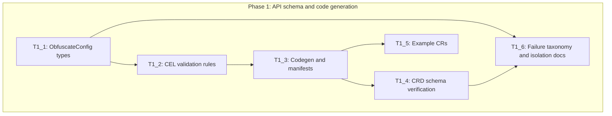
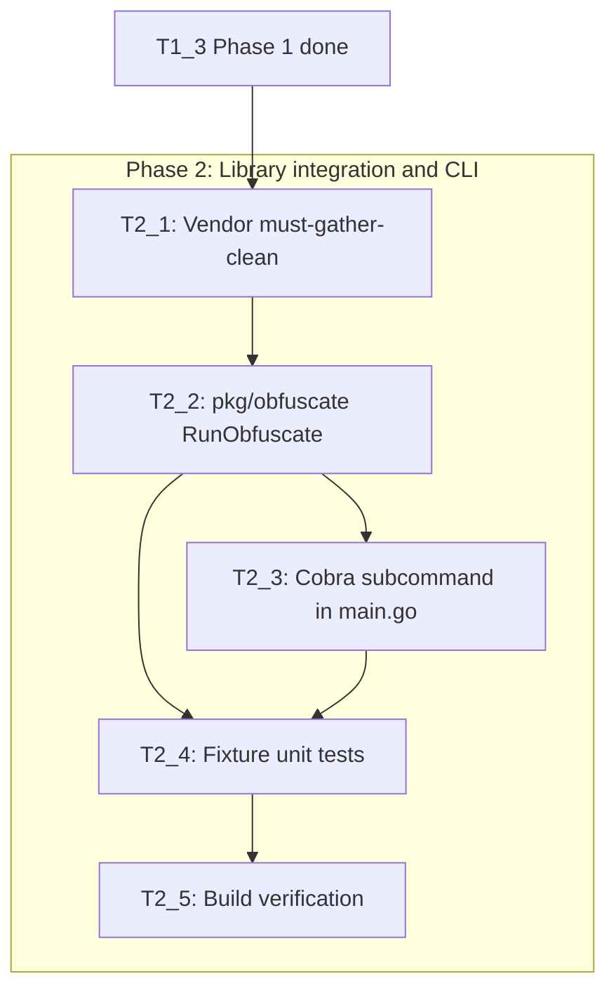
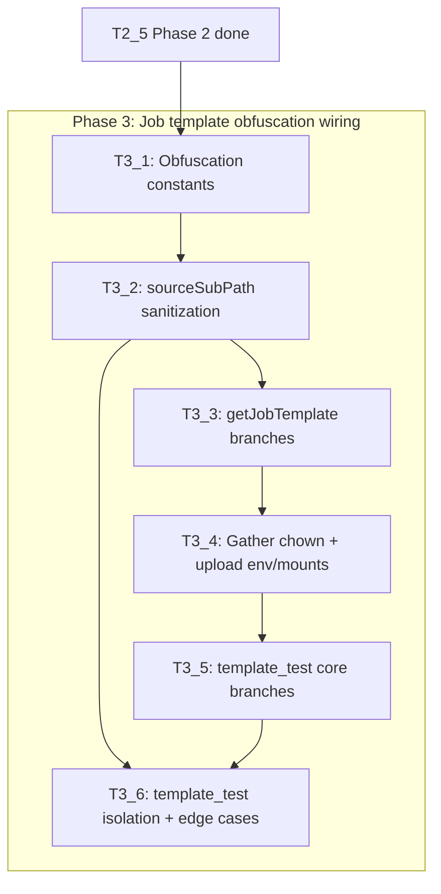
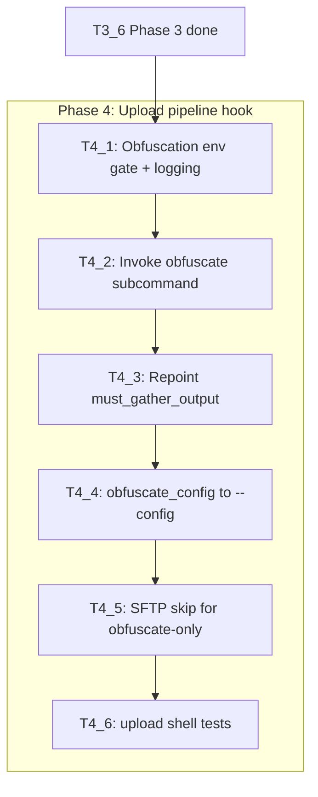
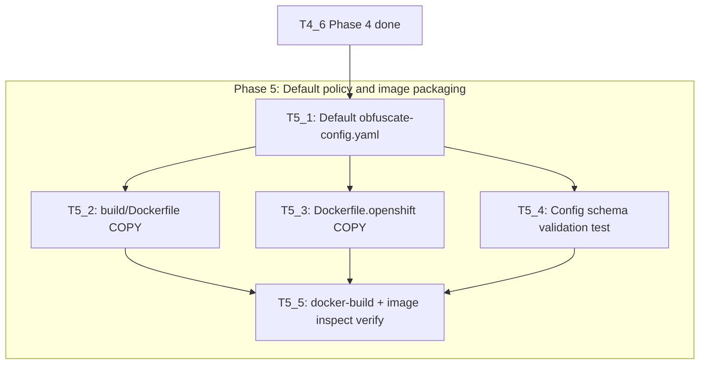
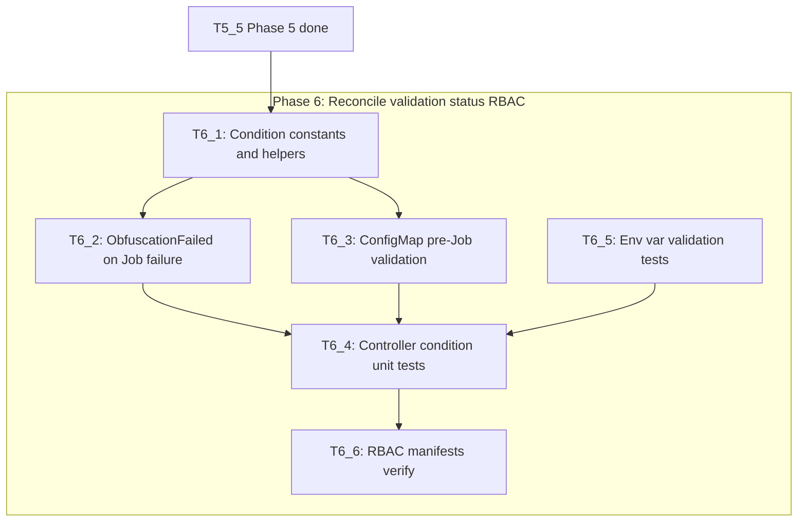
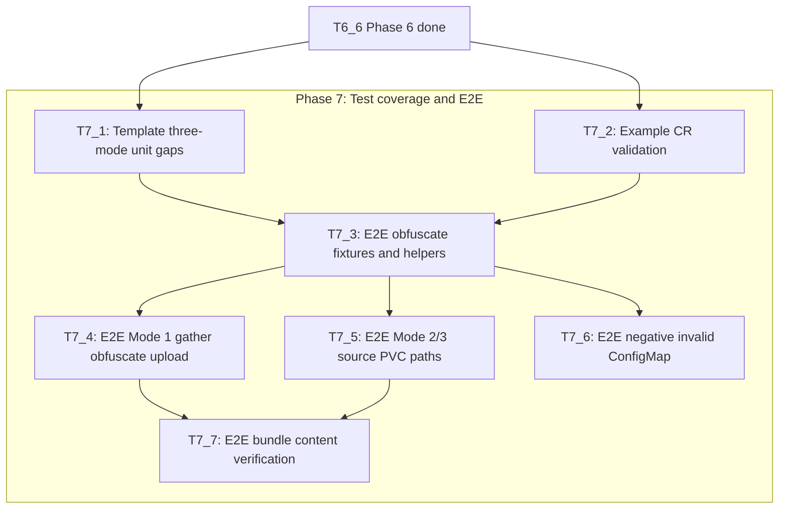

# Execution Backlog — Must-Gather Bundle Obfuscation (MG-293)

**Feature:** Must-Gather Bundle Obfuscation  
**AgentRoutingMode:** PROVIDED  
**ConstitutionVersion:** 1.0.0  
**Phase scope:** Phase 1 of 7 — API schema and code generation  
**Task sizing:** defaults (min 5, max 15, consolidation_threshold 2)

## 0. Input coverage checklist (Phase 1 scope)

| Requirement / Plan item | Covering Task IDs | Notes |
|-------------------------|-------------------|-------|
| Plan Phase 1: API schema + CEL + codegen | T1_1, T1_2, T1_3, T1_4 | Full phase coverage |
| FR-001 Enable obfuscation config block | T1_1 | `ObfuscateConfig` types |
| FR-012 Reject enabled without source/upload | T1_2 | CEL rule |
| FR-013 Reject source without enabled | T1_2 | CEL rule |
| FR-011 Backward compatible optional field | T1_1, T1_3 | omitempty pointers |
| SC-007 Upgrade compatibility (schema) | T1_3, T1_4 | CRD additive change |
| PVC per-invocation isolation (plan §2) | T1_1, T1_5 | API contract; **verification** of **multiple runs** on **PVC** producing **separate** dirs → Phase 3 (T3_4) |
| Distinct status condition types (plan §3.2) | T1_6 | API/godoc prep; implementation → Phase 6 (T6_2) |
| Env var default validation (plan §6) | — | Phase 6 (T6_3); no env changes in Phase 1 |
| FR-002–FR-010, SC-001–SC-006, SC-008 | — | Later phases (2–7) |

## 1. Task Dependency Graph (Phase 1)

## 2. Linear Execution Order (Phase 1)

1. - [x] T1_1 — Define ObfuscateConfig API types
2. - [x] T1_2 — Add CEL validation rules for obfuscation field combinations
3. - [x] T1_3 — Regenerate deepcopy, CRD, and bundle manifests
4. - [x] T1_4 — Verify CRD schema and additive backward compatibility
5. - [x] T1_5 — Add example MustGather CRs with obfuscate configuration
6. - [x] T1_6 — Document failure categories and PVC isolation API contract

## 3. Task Execution Manifest (Phase 1)

| Task ID | Task Title | Assigned Agent | Phase | Depends On | Parallel OK | Complexity | Risk |
|---------|-----------|---------------|-------|-----------|------------|-----------|------|
| T1_1 | Define ObfuscateConfig API types | api-types | Phase 1 | none | No | 3 | Low |
| T1_2 | Add CEL validation rules | api-types | Phase 1 | T1_1 | No | 3 | Med |
| T1_3 | Regenerate codegen and manifests | manifests-rbac | Phase 1 | T1_2 | No | 2 | Med |
| T1_4 | Verify CRD schema and compatibility | tests | Phase 1 | T1_3 | Yes | 2 | Low |
| T1_5 | Add example obfuscation CRs | examples-docs | Phase 1 | T1_3 | Yes | 1 | Low |
| T1_6 | Document failure taxonomy and isolation contract | api-types | Phase 1 | T1_1, T1_4 | No | 2 | Low |

## 4. Task Specifications (Payloads)

### Task T1_1: Define ObfuscateConfig API types

- **Objective:** Add `Obfuscate`, `ObfuscateConfig`, and `ObfuscateSourceConfig` types to `MustGatherSpec` per plan §3.1.
- **Target file(s):** `api/v1alpha1/mustgather_types.go`
- **Non-goals / forbidden edits:** Do not modify reconcile logic, Job template, or upload script. Do not hand-edit generated files.
- **Implementation notes:**
  - Use pointer `*bool` for `enabled` with kubebuilder default `false`.
  - Reuse existing `PersistentVolumeClaimReference` for `source.claim`.
  - `obfuscationConfigRef` is `*corev1.LocalObjectReference` (operator namespace documented in field comments).
  - `source.subPath` optional string — design must align with existing `storage.persistentVolume.subPath` trim semantics (`outputSubPath` uses `strings.TrimSpace` / `Trim`).
  - Preserve spec immutability CEL on `MustGather` root type.
- **Acceptance criteria:**
  - Types compile with kubebuilder markers.
  - `obfuscate` field is optional (`omitempty`).
  - Co-generate or update API type tests if repo pattern exists for struct tags.
  - Field comments document read-only source **PVC** semantics and compatibility with per-run `directoryName` **isolation** (existing gather **storage** path).
- **Downstream handoff:** T1_2 adds CEL; T1_3 regenerates CRD.

### Task T1_2: Add CEL validation rules for obfuscation field combinations

- **Objective:** Implement FR-012 and FR-013 via kubebuilder CEL on `MustGatherSpec` / `ObfuscateConfig`.
- **Target file(s):** `api/v1alpha1/mustgather_types.go`
- **Non-goals / forbidden edits:** No admission webhooks. No controller validation yet.
- **Implementation notes:**
  - Reject `obfuscate.enabled == true` when neither `obfuscate.source` nor `uploadTarget` is set (plan §8 default: reject obfuscate-only without upload).
  - Reject `obfuscate.source` present when `obfuscate.enabled` is not true.
  - Follow existing CEL style on `MustGatherSpec` (XValidation markers on struct).
  - **Edge case:** CEL cannot trim whitespace — document that **empty** or **whitespace-only** `subPath` values rely on controller/template **sanitization** in Phase 3; add OpenAPI minLength where applicable.
- **Acceptance criteria:**
  - CEL messages are user-readable.
  - Invalid combos fail OpenAPI/CRD validation at create time.
  - **Test:** extend or add unit **test** validating CEL rule strings present in generated CRD YAML (grep or schema assert).
- **Downstream handoff:** T1_3 regenerates CRD embedding rules.

### Task T1_3: Regenerate codegen and manifests

- **Objective:** Produce updated deepcopy, OpenAPI, CRD, and bundle copies after API changes.
- **Target file(s):** `api/v1alpha1/zz_generated.deepcopy.go`; `deploy/crds/operator.openshift.io_mustgathers.yaml`; bundle CRD under `bundle/manifests/`
- **Non-goals / forbidden edits:** Do not hand-edit generated YAML. Do not edit `boilerplate/` directly.
- **Implementation notes:**
  - Run `make generate && make manifests` per constitution IV and repo-assessment §7.
  - Verify both deploy and bundle CRD copies updated.
  - No new operator **environment variable** requirements in this phase.
- **Acceptance criteria:**
  - `make validate` passes.
  - CRD contains `obfuscate` property with subfields.
  - `make go-build` succeeds.
  - Phase 1 introduces no new required **environment variable**s; existing **default** image env **validation** (non-**empty** guards) unchanged — Phase 6 adds obfuscation-specific env **validation** tasks.
- **Downstream handoff:** T1_4 verifies schema; T1_5 adds examples referencing stable field names.

### Task T1_4: Verify CRD schema and backward compatibility

- **Objective:** Confirm additive schema change and CEL rules embedded correctly.
- **Target file(s):** `deploy/crds/operator.openshift.io_mustgathers.yaml`; `bundle/manifests/` CRD copy; test file alongside existing controller tests if added
- **Non-goals / forbidden edits:** Do not change API types in this task — verification only (fix forward if failures found).
- **Implementation notes:**
  - Assert existing example CRs without `obfuscate` remain valid.
  - Assert CRD OpenAPI lists new fields as optional.
  - Document that existing `storage.persistentVolume.subPath` + runtime `directoryName` **isolation** behavior is unchanged — Phase 3 template **test** will **verify** **multiple runs** on shared **PVC** yield **separate** output paths.
- **Acceptance criteria:**
  - **Verification** test or scripted check confirms CRD has CEL rules from T1_2.
  - `make go-test` passes.
  - No required new fields on existing MustGather specs.
- **Downstream handoff:** Phase 2+ builds on frozen API shape.

### Task T1_5: Add example MustGather CRs with obfuscate configuration

- **Objective:** Provide reference YAML for gather+obfuscate+upload and source-based modes.
- **Target file(s):** `examples/` (new or updated YAML files)
- **Non-goals / forbidden edits:** No controller or template changes.
- **Implementation notes:**
  - Include examples for: default policy + upload; custom `obfuscationConfigRef`; source PVC + upload.
  - Omit obfuscate-only-without-upload example (rejected by CEL per plan §8).
  - Show valid `subPath` values; comment on **empty**/invalid **subPath** handling deferred to runtime.
- **Acceptance criteria:**
  - Examples validate against generated CRD (`oc apply --dry-run=server` or equivalent).
  - Field names match T1_1 API json tags.
- **Downstream handoff:** Docs/E2E reference in Phase 7.

### Task T1_6: Document failure taxonomy and PVC isolation API contract

- **Objective:** Capture API-level documentation for downstream **distinct** **status** **condition** **types** and **PVC** **isolation** expectations.
- **Target file(s):** `api/v1alpha1/mustgather_types.go` (godoc comments); optional short note in `examples/README` if exists
- **Non-goals / forbidden edits:** Do not implement controller conditions (Phase 6).
- **Implementation notes:**
  - Document planned condition types: `ObfuscationConfigInvalid`, `ObfuscationFailed` (plan §3.2) — **distinct** from generic `ReconcileError` for obfuscation-specific **failures**.
  - Document that `obfuscate.source` mounts are read-only; writes go to upload staging volume (Phase 4).
  - Cross-reference existing gather `storage` **PVC** **isolation** via dynamic subPath + directoryName.
- **Acceptance criteria:**
  - Godoc on `ObfuscateConfig` explains **validation** **failure** modes at CR vs Job runtime.
  - References FR-012/FR-013 behavior.
- **Downstream handoff:** Phase 6 implements condition types; Phase 3 verifies mount/**isolation** **test**s.

## 5. Orchestration notes (Phase 1)

### Retry Boundaries

- T1_3 (`make generate && make manifests`) is safe to retry if interrupted; commit all generated files atomically.
- T1_2 CEL syntax errors surface at `make manifests` — fix types/markers and re-run T1_3.

### Merge Conflict Hotspots

- `api/v1alpha1/mustgather_types.go` — high churn if parallel API work.
- `deploy/crds/operator.openshift.io_mustgathers.yaml` and bundle CRD — always regenerate, never manual merge.
- `zz_generated.deepcopy.go` — regenerate only.

### Open Questions Requiring SME Before Execution

- **Source PVC namespace (plan §8 Q1):** Default assumption CR namespace for `source.claim` — confirm before Phase 3 template work (blocks T3_x, not T1_x).
- **Obfuscate-only rejection (plan §8 Q2):** Phase 1 CEL implements reject — confirm with SME before T1_2 merges.

### Forward coverage (later phases)

| Eval concern | Deferred task phase |
|--------------|---------------------|
| PVC multi-run **isolation** integration **test** | Phase 3 — T3_4 (template_test) |
| **Edge case** runtime **subPath** **sanitization** | Phase 3 — T3_2 |
| **Distinct** **condition** **type** implementation | Phase 6 — T6_2 |
| **Environment variable** **default** **empty** **validation** | Phase 6 — T6_3 |

---

**Phase 1 complete when all T1_* tasks marked `[x]` in implementation tracking.**

---

# Phase 2 — Obfuscation library integration and CLI entrypoint

**Phase scope:** Phase 2 of 7 — Obfuscation library integration and CLI entrypoint  
**Task sizing:** defaults (min 5, max 15, consolidation_threshold 2)

## 0. Input coverage checklist (Phase 2 scope)

| Requirement / Plan item | Covering Task IDs | Notes |
|-------------------------|-------------------|-------|
| Plan Phase 2: vendor + CLI + audit log | T2_1, T2_2, T2_3, T2_4, T2_5 | Full phase coverage |
| FR-015 No additional container images | T2_2, T2_3 | Library in operator binary |
| FR-016 Consume must-gather-clean as dependency | T2_1, T2_2 | `pkg/cli.Run()` — do not fork library |
| FR-009 Obfuscation audit log in output | T2_2, T2_4 | `report.yaml` + `obfuscation.log` |
| SC-001–SC-006 functional obfuscation | T2_4 | Fixture **test**; full E2E → Phase 7 |
| FR-005–FR-008 custom/default policy | T2_2 | `--config` flag; default path constant only (file → Phase 5) |
| PVC per-invocation isolation | — | **Verification** of **multiple runs** on **PVC** producing **separate** dirs → Phase 3 (T3_4) |
| **Edge case** runtime **subPath** **sanitization** (empty, whitespace-only paths) | — | Phase 3 (T3_2); CEL cannot trim — controller/template **test** covers **sanitization** |
| **Distinct** **status** **condition** **types** | — | Phase 6 (T6_2); godoc prep done in T1_6 |
| **Environment variable** **default** **empty** **validation** | T2_5 | Phase 2 preserves existing operator env gates; obfuscation-specific env → Phase 6 (T6_3) |
| Job template / upload script | — | Phases 3–4 |

## 1. Task Dependency Graph (Phase 2)

## 2. Linear Execution Order (Phase 2)

1. - [x] T2_1 — Add and vendor must-gather-clean dependency
2. - [x] T2_2 — Implement pkg/obfuscate RunObfuscate wrapper
3. - [x] T2_3 — Wire obfuscate Cobra subcommand in main.go
4. - [x] T2_4 — Add fixture-based unit tests for obfuscate path
5. - [x] T2_5 — Verify operator binary build and subcommand dispatch

## 3. Task Execution Manifest (Phase 2)

| Task ID | Task Title | Assigned Agent | Phase | Depends On | Parallel OK | Complexity | Risk |
|---------|-----------|---------------|-------|-----------|------------|-----------|------|
| T2_1 | Add and vendor must-gather-clean dependency | controller-reconcile | Phase 2 | T1_3 | No | 2 | Med |
| T2_2 | Implement pkg/obfuscate RunObfuscate wrapper | controller-reconcile | Phase 2 | T2_1 | No | 3 | Med |
| T2_3 | Wire obfuscate Cobra subcommand in main.go | controller-reconcile | Phase 2 | T2_2 | No | 3 | Med |
| T2_4 | Add fixture-based unit tests for obfuscate path | tests | Phase 2 | T2_2, T2_3 | No | 3 | Med |
| T2_5 | Verify operator binary build and subcommand dispatch | tests | Phase 2 | T2_4 | No | 2 | Low |

## 4. Task Specifications (Payloads)

### Task T2_1: Add and vendor must-gather-clean dependency

- **Objective:** Introduce `github.com/openshift/must-gather-clean` as a direct module dependency and refresh `vendor/` per repo convention.
- **Target file(s):** `go.mod`; `go.sum`; `vendor/`
- **Non-goals / forbidden edits:** Do not implement obfuscation logic or modify `main.go` yet. Do not hand-edit vendor except via `go mod vendor`. Do not add `build/obfuscate-config.yaml` (Phase 5).
- **Implementation notes:**
  - Pin to a released tag (e.g. `v0.0.5`) unless upstream compatibility review dictates otherwise.
  - Verify public API at implementation time: `github.com/openshift/must-gather-clean/pkg/cli.Run(configPath, inputPath, outputPath, deleteOutputFolder, reportingFolder, workerCount)` — plan/jira may reference `mgclean.Run()` as shorthand (FR-016: consume library as-is).
  - Run `go mod vendor` after `go get`; commit vendor tree atomically.
  - Expect transitive deps (`spf13/cobra`, `k8s.io/klog`, etc.) — do not duplicate obfuscation packages locally.
- **Acceptance criteria:**
  - `go.mod` lists `must-gather-clean` direct require.
  - `vendor/` contains upstream packages.
  - `make go-build` succeeds (may still lack subcommand until T2_3).
- **Downstream handoff:** T2_2 imports `pkg/cli` from vendored module.

### Task T2_2: Implement pkg/obfuscate RunObfuscate wrapper

- **Objective:** Create `pkg/obfuscate/` with a testable `RunObfuscate` function wrapping `cli.Run()` per plan §3.2 and FR-016.
- **Target file(s):** `pkg/obfuscate/` (new package — e.g. `run.go`, `constants.go`)
- **Non-goals / forbidden edits:** No Job template, upload script, or controller changes. No modification of must-gather-clean source. No Dockerfile/config file work (Phase 5).
- **Implementation notes:**
  - Hardcode worker count to **4** initially (plan §8 Q4 default).
  - Define `DefaultObfuscateConfigPath = "/etc/must-gather-clean/default-config.yaml"` constant for Phase 5 image COPY — file need not exist in repo yet.
  - CLI contract (frozen for Phase 3–4): `--input` (read-only gather root), `--output` (staging cleaned tree), `--config` (optional; default to constant path).
  - Pass `deleteOutputFolder=false` unless explicit overwrite flag added later.
  - Set `reportingFolder` to output directory so library writes `report.yaml` into cleaned output (FR-009, specs A-014).
  - Additionally capture klog output to `obfuscation.log` in the output directory (plan §3.2 / jira-spec audit requirement) — e.g. tee/redirect during Run or post-copy `report.yaml` alongside log file; input directory MUST remain unmodified (FR-010 semantics at library level).
  - Return errors to caller; do not call `klog.Exitf` in wrapper (upload container owns exit code).
  - Co-generate table-driven unit **test** stubs for happy-path error wrapping if feasible without full fixture (full fixture → T2_4).
- **Acceptance criteria:**
  - `RunObfuscate` accepts input/output/config paths and invokes `cli.Run` with 4 workers.
  - Package compiles; `go test ./pkg/obfuscate/...` passes for any co-generated stub tests.
  - Document in godoc that library emits `report.yaml`; wrapper ensures audit log artifact in output.
- **Downstream handoff:** T2_3 binds flags to `RunObfuscate`; Phase 4 upload script invokes `must-gather-operator obfuscate ...`.

### Task T2_3: Wire obfuscate Cobra subcommand in main.go

- **Objective:** Refactor binary entry so `must-gather-operator obfuscate --input ... --output ... [--config ...] -v=3` runs obfuscation without starting the controller manager (jira-spec invocation).
- **Target file(s):** `main.go`; optionally `cmd/operator/main.go` + `cmd/obfuscate/main.go` if split improves testability — discover during implementation (Evidence: PARTIAL)
- **Non-goals / forbidden edits:** Do not change reconciler registration logic beyond extracting operator startup into a subcommand/default path. Do not alter existing operator env validation behavior for the `operator`/`manager` path.
- **Implementation notes:**
  - Add `spf13/cobra` root command: default `Run` starts manager (existing behavior); `obfuscate` subcommand calls `pkg/obfuscate.RunObfuscate`.
  - Required flags on obfuscate: `--input`, `--output`; optional `--config` defaulting to `DefaultObfuscateConfigPath`.
  - Preserve existing global flags (`-v`, zap/klog) for upload-container logging compatibility.
  - Obfuscate subcommand MUST exit 0 on success, non-zero on failure (for upload script `set -e`).
  - When argv indicates obfuscate, skip leader election, metrics, and manager startup.
- **Acceptance criteria:**
  - `must-gather-operator obfuscate --help` lists required flags.
  - Operator manager path unchanged when no subcommand (backward compatible container entry).
  - Co-generate minimal CLI parse **test** (invalid args → error) if repo pattern supports.
  - `make go-build` produces binary with both code paths.
- **Downstream handoff:** Phase 4 upload script calls this subcommand; Phase 3 sets env vars only.

### Task T2_4: Add fixture-based unit tests for obfuscate path

- **Objective:** Verify `RunObfuscate` and CLI integration against a minimal synthetic must-gather fixture directory (FR-009, SC-006; plan §6 integration row).
- **Target file(s):** `pkg/obfuscate/*_test.go`; test fixtures under `pkg/obfuscate/testdata/` (new); optional `main_obfuscate_test.go` if CLI tested via `os/exec`
- **Non-goals / forbidden edits:** No E2E/cluster tests (Phase 7). No template or upload script changes.
- **Implementation notes:**
  - Fixture: small tree with a file containing a sample IPv4/MAC and a `kind: Secret` YAML snippet.
  - Include minimal valid obfuscation config YAML in testdata (IP/MAC obfuscate + Secret omit rules).
  - Assert: input tree bytes unchanged after run; output dir contains obfuscated content; `report.yaml` present in output; `obfuscation.log` present (or equivalent audit artifact per T2_2 contract).
  - Assert consistent token replacement across two files sharing same IP (SC-003 spot-check).
  - Use table-driven tests per repo convention (`controllers/mustgather/*_test.go` pattern).
- **Acceptance criteria:**
  - `make go-test` passes including new package tests.
  - Tests cover success path and config-not-found error path.
  - **Verification** documents that input directory is not modified in place.
- **Downstream handoff:** Phase 7 E2E extends coverage; Phase 3 relies on frozen CLI contract.

### Task T2_5: Verify operator binary build and subcommand dispatch

- **Objective:** Confirm Phase 2 deliverables integrate cleanly with existing build targets and operator startup env gates remain intact.
- **Target file(s):** verification only — may add smoke **test** in `pkg/obfuscate/` or `main_test.go`
- **Non-goals / forbidden edits:** No functional changes unless build/test failures require minimal fixes.
- **Implementation notes:**
  - Run `make go-build` and `make go-test`.
  - Smoke: built binary `obfuscate --help` exits 0; missing required flags exits non-zero.
  - Confirm existing operator startup still requires `DEFAULT_MUST_GATHER_IMAGE` when running manager path — no regression to **environment variable** **default** **validation** (existing `main.go` gates).
  - Obfuscation path does not require operator namespace or Kubeconfig.
  - Document any new transitive module size/vendor hotspots for Phase 5 image build.
- **Acceptance criteria:**
  - `make go-build` succeeds.
  - `make go-test` passes.
  - **Environment variable** **default** **empty** **validation** unchanged for manager startup; **empty** `DEFAULT_MUST_GATHER_IMAGE` still fails fast with clear error.
  - Phase 2 introduces no new required operator **environment variable**s.
- **Downstream handoff:** Phase 3 begins Job template wiring using frozen CLI invocation string.

## 5. Orchestration notes (Phase 2)

### Retry Boundaries

- T2_1 vendor refresh is safe to retry; always commit `go.mod`, `go.sum`, and `vendor/` together.
- If `go mod vendor` conflicts with FIPS/build tags, fix in T2_1 before proceeding — do not partial-commit vendor.

### Merge Conflict Hotspots

- `vendor/` — large churn; regenerate rather than manual merge.
- `go.mod` / `go.sum` — merge conflicts resolved by re-running `go mod tidy && go mod vendor`.
- `main.go` — single entrypoint; serialize T2_3 with any parallel controller work.

### Open Questions Requiring SME Before Execution

- **CLI framework split (`main.go` vs `cmd/` tree):** Default single-file Cobra wiring unless file exceeds maintainability — blocks T2_3 only.
- **Audit log naming (`obfuscation.log` vs `report.yaml` only):** Default both — library `report.yaml` plus operator-captured log — confirm with SME if upload script expects exact filename (blocks T2_2, T2_4).

### Forward coverage (later phases)

| Eval concern | Deferred task phase |
|--------------|---------------------|
| PVC multi-run **isolation** integration **test** | Phase 3 — T3_4 (template_test) |
| **Edge case** **empty**/whitespace **subPath** **sanitization** **test** | Phase 3 — T3_2 |
| **Distinct** **condition** **type** for obfuscation **failure** **status** | Phase 6 — T6_2 |
| **Environment variable** **default** **empty** **validation** (obfuscation env injection) | Phase 6 — T6_3 |

---

**Phase 2 complete when all T2_* tasks marked `[x]` in implementation tracking.**

---

# Phase 3 — Job template: multi-container volume consistency

**Phase scope:** Phase 3 of 7 — Job template wiring (env vars, gather chown, optional gather omission, ConfigMap and source PVC mounts)  
**Task sizing:** defaults (min 5, max 15, consolidation_threshold 2)

## 0. Input coverage checklist (Phase 3 scope)

| Requirement / Plan item | Covering Task IDs | Notes |
|-------------------------|-------------------|-------|
| Plan Phase 3: Job template obfuscation wiring | T3_1, T3_2, T3_3, T3_4, T3_5, T3_6 | Full phase coverage |
| FR-010 Source bundle unmodified (read-only mount) | T3_3, T3_4, T3_5 | Source PVC read-only at `/must-gather` |
| FR-011 Backward compatible nil obfuscate | T3_5, T3_6 | No env/volume changes when obfuscate nil/disabled |
| FR-015 No additional container images | T3_3, T3_4 | Reuse operator image upload container |
| Mode 1 gather chown (jira-spec §Mode 1 step 3) | T3_4, T3_5 | `chown -R 65534:65534 /must-gather` |
| Mode 2/3 omit gather when source set | T3_3, T3_5 | Upload-only Job shape |
| Mode 2 obfuscate-only (source, no upload) | T3_3 | Upload container without SFTP env |
| Custom policy ConfigMap mount (FR-007, A-004) | T3_3, T3_4, T3_5 | Operator-namespace ConfigMap; key `config.yaml` |
| Upload env `obfuscate` / `obfuscate_config` (plan §3.2) | T3_1, T3_4, T3_5 | Phase 4 upload script consumes vars |
| Mount consistency gather+upload (constitution III) | T3_4, T3_5, T3_6 | Matching subPath on shared volume |
| PVC per-invocation **isolation** (plan §2, OCPBUGS-64626) | T3_6 | **Verification** of **multiple runs** on **PVC** producing **separate** dirs |
| **Edge case** **empty**/whitespace **subPath** **sanitization** | T3_2, T3_6 | `sourceSubPath` trim + **test** |
| **Distinct** **condition** **type** for obfuscation failures | — | Phase 6 (T6_2) |
| **Environment variable** **default** **empty** **validation** (obfuscation env) | — | Phase 6 (T6_3); Phase 3 injects conditional env only |
| Upload script obfuscation hook | — | Phase 4 |
| Default config in image | — | Phase 5 |

## 1. Task Dependency Graph (Phase 3)

## 2. Linear Execution Order (Phase 3)

1. - [x] T3_1 — Add obfuscation env and volume constants
2. - [x] T3_2 — Implement sourceSubPath sanitization helper with edge-case unit tests
3. - [x] T3_3 — Extend getJobTemplate and controller for obfuscation job shape
4. - [x] T3_4 — Wire gather chown and upload container obfuscation env/mount consistency
5. - [x] T3_5 — Add template_test coverage for core obfuscation branches
6. - [x] T3_6 — Add template_test PVC isolation verification and subPath edge cases

## 3. Task Execution Manifest (Phase 3)

| Task ID | Task Title | Assigned Agent | Phase | Depends On | Parallel OK | Complexity | Risk |
|---------|-----------|---------------|-------|-----------|------------|-----------|------|
| T3_1 | Add obfuscation env and volume constants | job-template | Phase 3 | T2_5 | No | 2 | Low |
| T3_2 | Implement sourceSubPath sanitization helper with edge-case unit tests | job-template | Phase 3 | T3_1 | No | 3 | Med |
| T3_3 | Extend getJobTemplate and controller for obfuscation job shape | job-template | Phase 3 | T3_2 | No | 5 | Med |
| T3_4 | Wire gather chown and upload container obfuscation env/mount consistency | job-template | Phase 3 | T3_3 | No | 5 | Med |
| T3_5 | Add template_test coverage for core obfuscation branches | tests | Phase 3 | T3_4 | No | 3 | Med |
| T3_6 | Add template_test PVC isolation verification and subPath edge cases | tests | Phase 3 | T3_5, T3_2 | No | 3 | Med |

## 4. Task Specifications (Payloads)

### Task T3_1: Add obfuscation env and volume constants

- **Objective:** Define upload-container environment variable names and ConfigMap volume identifiers for obfuscation wiring per plan §3.2 and jira-spec upload script contract.
- **Target file(s):** `controllers/mustgather/template.go` (const block); optionally `controllers/mustgather/constant.go` if repo convention prefers shared env names there
- **Non-goals / forbidden edits:** No Job shape changes yet. No upload script changes (Phase 4). Do not duplicate `pkg/obfuscate.DefaultObfuscateConfigPath` — reference or mirror mount path constant only.
- **Implementation notes:**
  - Add constants: `uploadEnvObfuscate = "obfuscate"`, `uploadEnvObfuscateConfig = "obfuscate_config"`.
  - Add volume/mount constants for custom policy ConfigMap (e.g. `obfuscateConfigVolumeName`, mount path under `/etc/must-gather-clean/` with key `config.yaml` subpath).
  - Add helper `obfuscateEnabled(spec *ObfuscateConfig) bool` returning true only when `spec != nil && spec.Enabled != nil && *spec.Enabled`.
  - Reuse frozen CLI default config path from `pkg/obfuscate.DefaultObfuscateConfigPath` for default `obfuscate_config` value when no custom ref set (document; full file ship → Phase 5).
- **Acceptance criteria:**
  - Constants compile; no behavior change when obfuscate nil.
  - Co-generate minimal unit **test** asserting constant string values match jira-spec (`obfuscate`, `obfuscate_config`) if repo pattern supports const tests.
  - `make go-build` succeeds.
- **Downstream handoff:** T3_2–T3_4 import constants; Phase 4 upload script reads `obfuscate` env.

### Task T3_2: Implement sourceSubPath sanitization helper with edge-case unit tests

- **Objective:** Provide `sourceSubPath(obfuscateSource *ObfuscateSourceConfig) (string, bool)` mirroring `outputSubPath` trim semantics for `obfuscate.source.subPath` (plan §2, FR-010 read-only mount path).
- **Target file(s):** `controllers/mustgather/template.go` (helper function); `controllers/mustgather/template_test.go` (edge-case tests)
- **Non-goals / forbidden edits:** No Job template wiring yet. No controller reconcile changes.
- **Implementation notes:**
  - Apply `strings.TrimSpace`, `strings.Trim(subPath, "/")` consistent with existing `outputSubPath`.
  - **Edge case:** **empty** string after trim → treat as no subPath (mount PVC root). **Whitespace-only** input → same as empty. Separator-only (`"/"`, `"//"`) → empty.
  - CEL `minLength` rejects literal empty at admission; controller must still **sanitize** whitespace-only values at runtime (Phase 1 T1_2 note).
  - Table-driven **test** cases: nil source, empty subPath, `"  "`, `"/"`, `"valid/nested/path"`, `" /trimmed/ "`.
- **Acceptance criteria:**
  - `sourceSubPath` returns `( "", false )` for nil source or empty-after-trim subPath.
  - **Sanitization** **test** covers **empty**, **whitespace-only**, and separator-only inputs.
  - `make go-test` passes for new tests.
- **Downstream handoff:** T3_3 uses helper for source PVC volume mount subPath; T3_6 adds Job-level **edge case** **test** integration.

### Task T3_3: Extend getJobTemplate and controller for obfuscation job shape

- **Objective:** Update Job assembly for three obfuscation modes: gather+obfuscate+upload, source-only obfuscate, source+obfuscate+upload (jira-spec Modes 1–3).
- **Target file(s):** `controllers/mustgather/template.go` (`getJobTemplate`, `initializeJobTemplate`); `controllers/mustgather/mustgather_controller.go` (`getJobFromInstance` — pass operator namespace)
- **Non-goals / forbidden edits:** No upload script logic (Phase 4). No status conditions (Phase 6). No chown/env injection yet (T3_4). No Dockerfile/config file (Phase 5).
- **Implementation notes:**
  - Thread `operatorNamespace string` into `getJobTemplate` for ConfigMap volume in **operator namespace** (A-004, plan §8 Q1 default: CR namespace for source claim, operator namespace for policy ConfigMap).
  - When `obfuscateEnabled`: **omit gather container** if `obfuscate.source` set (Modes 2/3).
  - When `obfuscateEnabled` and no SFTP upload target: still append **upload container** (Mode 2) with operator image — SFTP secret env omitted; obfuscation env added in T3_4.
  - When `obfuscate.source` set: add read-only PVC volume for source claim (CR namespace); mount at `/must-gather` via `sourceSubPath`; do not reuse gather `outputVolumeName` subPath from `directoryName` for source input.
  - When `obfuscationConfigRef` set: append ConfigMap volume + volumeMount on upload container mount path (name from T3_1).
  - When obfuscate disabled or nil: preserve exact current Job shape (FR-011).
  - Gather+storage mode unchanged: continue `directoryName`-scoped `outputSubPath` for writes.
- **Acceptance criteria:**
  - Source mode Job has upload container only (no gather).
  - Gather+obfuscate mode retains gather container.
  - ConfigMap volume present when custom ref set.
  - Controller passes operator namespace; `make go-build` succeeds.
  - Co-generate or extend template **test** stubs verifying container count per mode (full assertions → T3_5).
- **Downstream handoff:** T3_4 sets chown and upload env on containers created here.

### Task T3_4: Wire gather chown and upload container obfuscation env/mount consistency

- **Objective:** Implement gather ownership transfer and upload obfuscation environment/mount parity per constitution III and jira-spec Mode 1 step 3.
- **Target file(s):** `controllers/mustgather/template.go` (`getGatherContainer`, `getUploadContainer`, signatures updated to accept obfuscation config)
- **Non-goals / forbidden edits:** No upload script changes. No reconcile status updates. Do not change gather/upload container names (`gather`, `upload`).
- **Implementation notes:**
  - When obfuscate enabled and gather container present: append `chown -R 65534:65534 /must-gather` to gather bash command (after gather completes, before container exit) — upload runs as UID 65534.
  - Upload container when obfuscate enabled: set `obfuscate=true` env; set `obfuscate_config` to ConfigMap mount path when ref set, else `pkg/obfuscate.DefaultObfuscateConfigPath`.
  - **Mount consistency:** gather and upload MUST share identical `outputVolumeName` mount at `/must-gather` with matching `SubPath` from `outputSubPath(storage, directoryName)` when storage PVC used (constitution III).
  - Source mode: upload mounts source PVC read-only at `/must-gather` (no gather container); cleaned output still targets `/must-gather-upload` emptyDir (Phase 4 repoints `must_gather_output`).
  - Custom ConfigMap: read-only mount; key `config.yaml`.
  - Preserve existing SFTP/proxy/trusted-CA env when upload target present.
- **Acceptance criteria:**
  - Gather command includes chown when obfuscate enabled (not when disabled/nil).
  - Upload env includes `obfuscate=true` when enabled.
  - Upload env includes `obfuscate_config` with correct path for default vs custom ref.
  - Gather and upload volume mounts use matching subPath for PVC storage mode.
  - Co-generate table-driven **test** stubs if feasible (full coverage → T3_5).
  - `make go-test` passes.
- **Downstream handoff:** Phase 4 upload script reads env and invokes `must-gather-operator obfuscate --input /must-gather --output /must-gather-upload/cleaned [--config ...] -v=3`.

### Task T3_5: Add template_test coverage for core obfuscation branches

- **Objective:** Unit-test Job template obfuscation branches listed in jira-spec Test Plan §Unit Tests (chown, env, ConfigMap, gather omission, source PVC, backward compat).
- **Target file(s):** `controllers/mustgather/template_test.go`
- **Non-goals / forbidden edits:** No E2E tests (Phase 7). No controller reconcile tests (Phase 6). No upload script tests.
- **Implementation notes:**
  - Table-driven tests per repo convention (`Test_getJobTemplate_*` pattern).
  - Cases: (1) obfuscate nil → no obfuscate env, gather present; (2) enabled + upload → chown in gather, `obfuscate=true` in upload; (3) enabled + `obfuscationConfigRef` → ConfigMap volume + `obfuscate_config` env; (4) enabled + source → no gather, source PVC volume read-only; (5) enabled + source + upload → upload only with SFTP env retained.
  - Assert container names stable (`gather`, `upload`).
  - Use helper builders or fixtures consistent with existing `template_test.go` patterns.
- **Acceptance criteria:**
  - All five branch cases covered with explicit assertions.
  - `make go-test` passes.
  - Tests document frozen env var contract for Phase 4.
- **Downstream handoff:** T3_6 adds isolation and subPath edge integration; Phase 4 relies on passing template tests.

### Task T3_6: Add template_test PVC isolation verification and subPath edge cases

- **Objective:** Verify per-invocation PVC write **isolation** via distinct `directoryName` subPaths and validate **subPath** **sanitization** at Job template level (plan §2, eval forward coverage from Phase 1).
- **Target file(s):** `controllers/mustgather/template_test.go`
- **Non-goals / forbidden edits:** No live cluster integration test. No controller reconcile loop changes.
- **Implementation notes:**
  - **Isolation verification:** Generate two Jobs with same `spec.storage` PVC but different `directoryName` values; assert gather and upload mounts use **separate** subPath values (`base/dirA` vs `base/dirB`) — simulates **multiple runs** on same **PVC** producing **separate** output directories.
  - **Edge case integration:** Job with obfuscate source subPath `"  /nested  "` → mount subPath sanitized to `nested` (or equivalent trimmed form).
  - Confirm obfuscated write staging uses emptyDir upload volume, not source PVC subPath (FR-010).
  - Link test names/comments to OCPBUGS-64626 / plan §2 isolation analysis.
- **Acceptance criteria:**
  - **Verification** **test** proves two successive template generations on same PVC spec yield non-overlapping subPaths.
  - **Edge case** **test** covers whitespace **subPath** **sanitization** in Job mounts.
  - `make go-test` passes.
- **Downstream handoff:** Phase 6 may add reconcile-level validation; Phase 7 E2E validates cluster behavior.

## 5. Orchestration notes (Phase 3)

### Retry Boundaries

- T3_3/T3_4 template changes are safe to retry atomically; run `make go-test` after each task before proceeding.
- If gather/upload mount mismatch found in T3_5, fix in T3_4 and re-run tests — do not split mount logic across conflicting commits.

### Merge Conflict Hotspots

- `controllers/mustgather/template.go` — high churn; serialize T3_1→T3_4 in order.
- `controllers/mustgather/template_test.go` — T3_2, T3_5, T3_6 all touch; merge T3_5 before T3_6 or rebase carefully.
- `controllers/mustgather/mustgather_controller.go` — small signature change in T3_3 only.

### Open Questions Requiring SME Before Execution

- **Source-only upload pgrep wait:** Default rely on existing upload script pgrep loop exiting when no gather process (may add ~2 min delay) — if unacceptable, add `obfuscate_source=true` env in T3_4 and skip wait in Phase 4 upload script; blocks T3_4 only if SME rejects delay.
- **ConfigMap namespace for `obfuscationConfigRef`:** Default operator namespace (A-004); confirm no cross-namespace read required.
- **Obfuscate-only Job without SFTP credentials:** Upload container command still runs full upload script — Phase 4 must no-op SFTP when caseid unset; document dependency in T3_3 handoff.

### Forward coverage (later phases)

| Eval concern | Deferred task phase |
|--------------|---------------------|
| Upload script obfuscation invocation | Phase 4 |
| Default config file in image | Phase 5 |
| **Distinct** **condition** **type** for obfuscation **failure** **status** | Phase 6 — T6_2 |
| **Environment variable** **default** **empty** **validation** (obfuscation env injection) | Phase 6 — T6_3 |

---

**Phase 3 complete when all T3_* tasks marked `[x]` in implementation tracking.**

---

# Phase 4 — Upload pipeline hook

**Phase scope:** Phase 4 of 7 — Upload script obfuscation hook (pre-tar/SFTP)  
**Task sizing:** defaults (min 5, max 15, consolidation_threshold 2)

## 0. Input coverage checklist (Phase 4 scope)

| Requirement / Plan item | Covering Task IDs | Notes |
|-------------------------|-------------------|-------|
| Plan Phase 4: Upload pipeline hook | T4_1, T4_2, T4_3, T4_4, T4_5, T4_6 | Full phase coverage |
| FR-001 Enable obfuscation before upload (Mode 1) | T4_1, T4_2, T4_3 | Gate on `obfuscate=true`; repoint output |
| FR-002 Custom policy via ConfigMap (Mode 1/2/3) | T4_4 | `--config` from `obfuscate_config` env |
| FR-003 Consistent token replacement | T4_2, T4_6 | Delegated to CLI; script verifies invocation |
| FR-004 Default policy when no ConfigMap ref | T4_2, T4_4 | Default path from Phase 3 env |
| FR-009 Obfuscation audit log in output | T4_2, T4_6 | CLI writes `obfuscation.log`; script fails on non-zero exit |
| FR-010 Source bundle unmodified | T4_2, T4_3 | Separate `--output` staging dir; repoint `must_gather_output` |
| FR-014 Fail Job on obfuscation error | T4_2, T4_6 | `set -e` + non-zero CLI exit propagates |
| Mode 1 gather+obfuscate+upload (jira-spec §Mode 1 steps 5–11) | T4_1–T4_4 | Full upload pipeline after gather |
| Mode 2 obfuscate-only (source, no upload) | T4_5, T4_6 | Skip SFTP when credentials/caseid absent |
| Mode 3 obfuscate+upload from source PVC | T4_1–T4_4 | Same script path after source mount |
| SC-001 One-step gather-obfuscate-upload | T4_1–T4_4 | End-to-end script hook |
| SC-005 Source bundle unchanged | T4_2, T4_3 | Read from `/must-gather`, write to `/must-gather-upload/cleaned` |
| SC-006 Audit log present | T4_6 | Test verifies obfuscation step invoked before tar |
| Upload env contract from Phase 3 (`obfuscate`, `obfuscate_config`) | T4_1, T4_4 | Consumes frozen template env vars |
| PVC per-invocation **isolation** | — | Phase 3 (T3_6); upload reads repointed output only |
| **Edge case** **empty**/whitespace paths | T4_6 | Assert cleaned output path fixed; config path from env |
| **Distinct** **condition** **type** for obfuscation failures | — | Phase 6 (T6_2) |
| **Environment variable** **default** **empty** **validation** | — | Phase 6 (T6_3); upload script uses injected env only when enabled |
| Default config file in image | — | Phase 5 |
| E2E SFTP verification | — | Phase 7 |

## 1. Task Dependency Graph (Phase 4)

## 2. Linear Execution Order (Phase 4)

1. - [x] T4_1 — Add obfuscation env gate and log markers to upload script
2. - [x] T4_2 — Invoke must-gather-operator obfuscate before archiving
3. - [x] T4_3 — Repoint must_gather_output to cleaned staging directory
4. - [x] T4_4 — Wire obfuscate_config env to --config flag
5. - [x] T4_5 — Skip SFTP when upload credentials absent (obfuscate-only)
6. - [x] T4_6 — Add shell-level tests for upload obfuscation branches

## 3. Task Execution Manifest (Phase 4)

| Task ID | Task Title | Assigned Agent | Phase | Depends On | Parallel OK | Complexity | Risk |
|---------|-----------|---------------|-------|-----------|------------|-----------|------|
| T4_1 | Add obfuscation env gate and log markers to upload script | upload-script | Phase 4 | T3_6 | No | 2 | Low |
| T4_2 | Invoke must-gather-operator obfuscate before archiving | upload-script | Phase 4 | T4_1 | No | 3 | Med |
| T4_3 | Repoint must_gather_output to cleaned staging directory | upload-script | Phase 4 | T4_2 | No | 2 | Med |
| T4_4 | Wire obfuscate_config env to --config flag | upload-script | Phase 4 | T4_3 | No | 2 | Low |
| T4_5 | Skip SFTP when upload credentials absent (obfuscate-only) | upload-script | Phase 4 | T4_4 | No | 3 | Med |
| T4_6 | Add shell-level tests for upload obfuscation branches | tests | Phase 4 | T4_5 | No | 4 | Med |

## 4. Task Specifications (Payloads)

### Task T4_1: Add obfuscation env gate and log markers to upload script

- **Objective:** Extend `build/bin/upload` to detect Phase 3 upload-container env contract and emit operator-visible log markers before any tar/SFTP work (jira-spec Mode 1 step 5; plan Phase 4 verification hooks).
- **Target file(s):** `build/bin/upload`
- **Non-goals / forbidden edits:** No Job template or controller changes. Do not invoke the obfuscate binary yet (T4_2). Do not change existing SFTP credential validation behavior yet (T4_5).
- **Implementation notes:**
  - Read `obfuscate` env var (string `"true"` when enabled — matches Phase 3 `uploadEnvObfuscate`).
  - When enabled, log `"Running obfuscation"` before obfuscation step placeholder; when disabled, preserve existing script flow unchanged (FR-011 backward compatibility).
  - Preserve `set -o errexit` semantics; no partial tar when obfuscation will run.
  - Document frozen env contract in script header comments (`obfuscate`, `obfuscate_config`, `must_gather_output`, `must_gather_upload`).
  - **Edge case:** Treat unset/empty/false `obfuscate` as disabled — no obfuscation branch.
- **Acceptance criteria:**
  - Script parses `obfuscate=true` and logs `"Running obfuscation"` marker.
  - When `obfuscate` unset or not `true`, script behavior unchanged through credential check.
  - `bash -n build/bin/upload` passes.
- **Downstream handoff:** T4_2 inserts binary invocation after log marker.

### Task T4_2: Invoke must-gather-operator obfuscate before archiving

- **Objective:** When obfuscation enabled, run the frozen CLI contract before tar: `must-gather-operator obfuscate --input /must-gather --output /must-gather-upload/cleaned -v=3` (jira-spec §Mode 1 step 6; Phase 2/T2_3 handoff).
- **Target file(s):** `build/bin/upload`
- **Non-goals / forbidden edits:** No changes to Cobra subcommand (Phase 2 complete). No Dockerfile/config packaging (Phase 5). Do not tar from raw gather dir when obfuscation enabled (T4_3 repoints output).
- **Implementation notes:**
  - Resolve binary path: prefer `must-gather-operator` on `PATH` (container image layout); document fallback if repo uses absolute path in image.
  - Input: `${must_gather_output:-/must-gather}` (read-only gather/source mount from Phase 3).
  - Output: `${must_gather_upload}/cleaned` — create parent dir if needed; must not write into input path (FR-010).
  - Propagate non-zero exit from obfuscate command (`set -e`) — Job fails hard (FR-014).
  - Log `"Obfuscation complete"` on success (plan Phase 4 verification hook).
  - Run obfuscation **before** existing tar line (`echo "Archiving files from..."`).
  - **Edge case:** Fail with clear message if obfuscate binary missing when `obfuscate=true`.
- **Acceptance criteria:**
  - Obfuscation command invoked only when `obfuscate=true`.
  - Uses `--input` and `--output` paths matching Phase 3 mount contract.
  - Non-zero obfuscate exit causes upload script to exit non-zero without tar/SFTP.
  - `bash -n build/bin/upload` passes.
- **Downstream handoff:** T4_3 repoints `must_gather_output`; T4_4 adds `--config`.

### Task T4_3: Repoint must_gather_output to cleaned staging directory

- **Objective:** After successful obfuscation, set `must_gather_output="/must-gather-upload/cleaned"` so tar/SFTP operate on cleaned tree only (jira-spec Mode 1 step 9; FR-010).
- **Target file(s):** `build/bin/upload`
- **Non-goals / forbidden edits:** No template mount changes. Do not modify tar/SFTP remote path logic beyond input directory variable.
- **Implementation notes:**
  - Assign `must_gather_output="${must_gather_upload}/cleaned"` immediately after successful obfuscation (before archive echo).
  - When obfuscation disabled, retain existing default `${must_gather_output:="/must-gather-output"}` — note Phase 3 sets env to `/must-gather`; script defaults are legacy; prefer injected env from template.
  - Verify cleaned directory exists and is non-empty before tar (optional lightweight check — fail fast if missing).
  - Tar command must archive repointed path only — original gather/source mount remains untouched.
- **Acceptance criteria:**
  - With `obfuscate=true`, tar sources `${must_gather_upload}/cleaned`, not raw gather path.
  - With obfuscation disabled, tar sources original `must_gather_output` unchanged.
  - `bash -n build/bin/upload` passes.
- **Downstream handoff:** T4_4 passes config flag; Phase 7 E2E validates uploaded bundle content.

### Task T4_4: Wire obfuscate_config env to --config flag

- **Objective:** Pass Phase 3 `obfuscate_config` env to obfuscate subcommand `--config` when obfuscation enabled (FR-002, FR-004; custom vs default policy paths).
- **Target file(s):** `build/bin/upload`
- **Non-goals / forbidden edits:** No ConfigMap mount logic (Phase 3). No default config file creation (Phase 5).
- **Implementation notes:**
  - When `obfuscate_config` non-empty, append `--config "${obfuscate_config}"` to obfuscate invocation.
  - When unset/empty, omit `--config` and rely on Cobra default (`/etc/must-gather-clean/default-config.yaml` from Phase 2) — Phase 5 adds file to image.
  - **Edge case:** Whitespace-only `obfuscate_config` treated as empty (trim or reject with clear error).
  - Log chosen config path at `-v=3` via CLI (do not duplicate config parsing in shell).
- **Acceptance criteria:**
  - Custom config path forwarded when `obfuscate_config` set (matches Phase 3 template_test env assertions).
  - Default path used when env unset (obfuscate command receives default via Cobra).
  - `bash -n build/bin/upload` passes.
- **Downstream handoff:** T4_5 handles obfuscate-only without SFTP; Phase 5 ensures default config exists at path.

### Task T4_5: Skip SFTP when upload credentials absent (obfuscate-only)

- **Objective:** Support Mode 2 obfuscate-only Jobs where Phase 3 omits SFTP env vars — complete successfully after obfuscation without requiring `caseid`/`username`/`password` (jira-spec Mode 2; Phase 3 T3_3 handoff).
- **Target file(s):** `build/bin/upload`
- **Non-goals / forbidden edits:** No controller status updates (Phase 6). Do not remove SFTP path when credentials present.
- **Implementation notes:**
  - Restructure credential validation: when `obfuscate=true` and any of `caseid`, `username`, `password` empty, skip tar+SFTP after obfuscation with success exit and informative log (e.g. `"Obfuscation complete; no upload target configured"`).
  - When `obfuscate` not true, preserve existing hard fail on missing credentials (backward compatible).
  - When `obfuscate=true` and all credentials present, run full tar+SFTP pipeline on cleaned output (Mode 1/3).
  - **Edge case:** Partial credentials (some set, some missing) → fail with clear error (misconfiguration).
  - Document dependency: source-only Jobs may incur pgrep wait in upload container command (Phase 3 `uploadCommand`) — out of scope unless SME requests `obfuscate_source` fast-path env in follow-up task.
- **Acceptance criteria:**
  - Obfuscate-only path exits 0 without SFTP when credentials absent.
  - Obfuscate+upload path still requires credentials and uploads when all present.
  - Non-obfuscate path unchanged: missing credentials still exit 1.
  - `bash -n build/bin/upload` passes.
- **Downstream handoff:** T4_6 tests all branches; Phase 7 E2E covers Mode 2/3 cluster behavior.

### Task T4_6: Add shell-level tests for upload obfuscation branches

- **Objective:** Verify upload script obfuscation integration via shell tests — branch coverage, failure propagation, and log markers (plan Phase 4 verification hooks; Tier 4 non-Go).
- **Target file(s):** `build/bin/upload_test.sh` (new) or `build/bin/upload_test.bats` — follow repo convention if exists; else `build/bin/upload_test.sh` + document in task report
- **Non-goals / forbidden edits:** No cluster E2E (Phase 7). No Go unit tests for shell script. Do not mock real SFTP in CI unless existing pattern supports it.
- **Implementation notes:**
  - Test cases (use stub `must-gather-operator` on PATH):
    1. `obfuscate` unset → no obfuscation invocation; credential check unchanged.
    2. `obfuscate=true` → stub obfuscate called with expected `--input`/`--output`; logs contain `"Running obfuscation"` and `"Obfuscation complete"`.
    3. `obfuscate=true` + stub exits 1 → upload script exits non-zero; tar not reached (mock tar to fail if invoked).
    4. `obfuscate=true` + `obfuscate_config=/custom/config.yaml` → stub receives `--config` arg.
    5. `obfuscate=true` without credentials → exits 0 after obfuscation; no SFTP (mock `sshpass`/`sftp` must not run).
    6. `obfuscate=true` with credentials → tar invoked on `${must_gather_upload}/cleaned` after repoint.
  - Use temp dirs for `must_gather_output`, `must_gather_upload`, and minimal input tree.
  - Run via `bash build/bin/upload_test.sh` or `make` target if added — prefer minimal new Makefile hook only if repo pattern requires.
  - **Verification** documents FR-010: input fixture bytes unchanged after obfuscate-only run (stub copies input → output).
- **Acceptance criteria:**
  - All six branch cases pass in CI/local test runner.
  - `bash -n build/bin/upload` passes.
  - Test runner documented in task report; `make go-test` unaffected (shell test may run standalone or via `make verify` if wired).
- **Downstream handoff:** Phase 5 adds default config file; Phase 7 extends to cluster Job log checks.

## 5. Orchestration notes (Phase 4)

### Retry Boundaries

- T4_1–T4_5 are sequential edits to one shell script — retry atomically; run `bash -n build/bin/upload` after each task.
- If T4_6 reveals branch ordering bugs, fix in the responsible T4_* task and re-run shell tests — do not patch script and tests in conflicting commits.

### Merge Conflict Hotspots

- `build/bin/upload` — sole high-churn file; serialize T4_1→T4_5.
- `build/bin/upload_test.sh` — T4_6 only; merge after script stable.

### Open Questions Requiring SME Before Execution

- **Source-mode pgrep delay:** Upload container `uploadCommand` in `template.go` waits for gather process even when gather omitted — ~2 min delay acceptable for Tech Preview? If not, add follow-up task to inject `obfuscate_source=true` env in template and skip pgrep loop (crosses Phase 3/4 boundary).
- **Binary path in container:** Confirm image installs operator binary as `must-gather-operator` on PATH (Dockerfile Phase 5) — T4_2 uses PATH lookup with documented absolute fallback if build differs.
- **Default config missing in dev:** Until Phase 5 copies `build/obfuscate-config.yaml`, local obfuscate runs may fail config-not-found — T4_6 stub avoids real CLI; integration tests defer to Phase 5/7.

### Forward coverage (later phases)

| Eval concern | Deferred task phase |
|--------------|---------------------|
| Default config file in operator image | Phase 5 |
| **Distinct** **condition** **type** for obfuscation **failure** **status** | Phase 6 — T6_2 |
| **Environment variable** **default** **empty** **validation** (operator startup / obfuscation env injection) | Phase 6 — T6_3 |
| PVC multi-run **isolation** cluster **verification** | Phase 7 E2E |
| E2E SFTP obfuscated bundle inspection | Phase 7 |

---

**Phase 4 complete when all T4_* tasks marked `[x]` in implementation tracking.**

---

# Phase 5 — Default policy and image packaging

**Phase scope:** Phase 5 of 7 — Ship default obfuscation config in operator image  
**Task sizing:** defaults (min 5, max 15, consolidation_threshold 2)

## 0. Input coverage checklist (Phase 5 scope)

| Requirement / Plan item | Covering Task IDs | Notes |
|-------------------------|-------------------|-------|
| Plan Phase 5: Default policy and image packaging | T5_1, T5_2, T5_3, T5_4, T5_5 | Full phase coverage |
| FR-005 Default IP/MAC obfuscation + Secret/ConfigMap omission | T5_1, T5_4 | `build/obfuscate-config.yaml` content |
| FR-006 Preserve loopback/local addresses | T5_1 | Document must-gather-clean default behavior; no extra omit rules |
| FR-007–FR-008 Custom policy via ConfigMap | — | Phase 3 mount + Phase 4 `--config`; Phase 5 ships default only |
| FR-015 No additional container images | T5_2, T5_3 | COPY into existing operator image |
| SC-001–SC-003 Default policy outcomes | T5_1, T5_4, T5_5 | Config validates; image path matches `DefaultObfuscateConfigPath` |
| Phase 2 `DefaultObfuscateConfigPath` constant | T5_2, T5_3, T5_5 | `/etc/must-gather-clean/default-config.yaml` |
| Phase 4 upload `--config` default fallback | T5_5 | End-to-end path exists at runtime in image |
| Upload script obfuscation hook | — | Phase 4 complete |
| **Distinct** **condition** **type** for obfuscation failures | — | Phase 6 (T6_2) |
| **Environment variable** **default** **empty** **validation** | — | Phase 6 (T6_3) |
| E2E bundle inspection | — | Phase 7 |

## 1. Task Dependency Graph (Phase 5)

## 2. Linear Execution Order (Phase 5)

1. - [x] T5_1 — Add default obfuscation policy file `build/obfuscate-config.yaml`
2. - [x] T5_2 — Package default config in `build/Dockerfile` operator image
3. - [x] T5_3 — Package default config in `Dockerfile.openshift` operator image
4. - [x] T5_4 — Add unit test validating default config loads via RunObfuscate fixture path
5. - [x] T5_5 — Verify `make docker-build` and image contains default config at expected path

## 3. Task Execution Manifest (Phase 5)

| Task ID | Task Title | Assigned Agent | Phase | Depends On | Parallel OK | Complexity | Risk |
|---------|-----------|---------------|-------|-----------|------------|-----------|------|
| T5_1 | Add default obfuscation policy file build/obfuscate-config.yaml | image-packaging | Phase 5 | T4_6 | No | 3 | Med |
| T5_2 | Package default config in build/Dockerfile operator image | image-packaging | Phase 5 | T5_1 | Yes | 2 | Low |
| T5_3 | Package default config in Dockerfile.openshift operator image | image-packaging | Phase 5 | T5_1 | Yes | 2 | Low |
| T5_4 | Add unit test validating default config loads via RunObfuscate | tests | Phase 5 | T5_1 | Yes | 3 | Med |
| T5_5 | Verify make docker-build and image contains default config path | image-packaging | Phase 5 | T5_2, T5_3, T5_4 | No | 3 | Med |

## 4. Task Specifications (Payloads)

### Task T5_1: Add default obfuscation policy file `build/obfuscate-config.yaml`

- **Objective:** Author the default must-gather-clean policy shipped in the operator image per jira-spec component #5, FR-005, and FR-006 (plan Phase 5).
- **Target file(s):** `build/obfuscate-config.yaml` (new)
- **Non-goals / forbidden edits:** No Dockerfile changes (T5_2/T5_3). No controller/upload script changes. Do not vendor or modify must-gather-clean source.
- **Implementation notes:**
  - Follow [must-gather-clean configuration schema](https://github.com/openshift/must-gather-clean#configuration) (FR-016 consume library as-is).
  - Default policy MUST: consistent IP obfuscation, consistent MAC obfuscation, omit Kubernetes `Secret` and `ConfigMap` resources (FR-005, SC-002).
  - Loopback/local address preservation (FR-006) relies on must-gather-clean built-in defaults — document in file header comment; do not add rules that break loopback behavior.
  - Align content with existing fixture patterns in `pkg/obfuscate/testdata/config.yaml` but expand omit list to include ConfigMap.
  - Destination path in image (document in comment): `/etc/must-gather-clean/default-config.yaml` — must match `pkg/obfuscate.DefaultObfuscateConfigPath`.
- **Acceptance criteria:**
  - Valid YAML parseable by must-gather-clean.
  - Documents FR-005/FR-006 intent in header comments.
  - Co-generate or extend test in T5_4 to load this file (not required in same commit if T5_4 follows immediately).
- **Downstream handoff:** T5_2/T5_3 COPY file; T5_4 validates with RunObfuscate.

### Task T5_2: Package default config in `build/Dockerfile` operator image

- **Objective:** Bake `build/obfuscate-config.yaml` into the UBI-based operator image at the frozen default path used by Phase 2–4 CLI/upload contract.
- **Target file(s):** `build/Dockerfile`
- **Non-goals / forbidden edits:** No changes to `Dockerfile.openshift` (T5_3). No gather/upload script logic. Do not change `USER 65534` or ENTRYPOINT.
- **Implementation notes:**
  - Create directory `/etc/must-gather-clean/` in runtime stage (before USER directive).
  - `COPY build/obfuscate-config.yaml /etc/must-gather-clean/default-config.yaml`
  - Ensure file is world-readable (644) so upload container UID 65534 can read default policy without custom ConfigMap.
  - Path MUST match `pkg/obfuscate.DefaultObfuscateConfigPath`.
- **Acceptance criteria:**
  - Dockerfile builds when `build/obfuscate-config.yaml` exists.
  - Image layer includes config at documented path (verified in T5_5).
  - `bash -n` N/A; `make docker-build` deferred to T5_5 if slow — at minimum `docker build -f build/Dockerfile` syntax valid.
- **Downstream handoff:** T5_5 image inspect verification.

### Task T5_3: Package default config in `Dockerfile.openshift` operator image

- **Objective:** Mirror T5_2 packaging for OpenShift CI `Dockerfile.openshift` so OCP build pipeline ships the same default policy path.
- **Target file(s):** `Dockerfile.openshift`
- **Non-goals / forbidden edits:** No changes to `build/Dockerfile` (T5_2). No CSV/OLM manifest changes.
- **Implementation notes:**
  - Same COPY target: `/etc/must-gather-clean/default-config.yaml` from `build/obfuscate-config.yaml`.
  - Keep parity with `build/Dockerfile` runtime layout (binary + upload scripts + default config).
  - Create `/etc/must-gather-clean/` before COPY; preserve `USER 65534:65534`.
- **Acceptance criteria:**
  - Both Dockerfiles use identical config destination path and source file.
  - OpenShift Dockerfile syntactically valid.
- **Downstream handoff:** T5_5 verifies at least one Dockerfile build path (prefer `build/Dockerfile` locally; document openshift parity).

### Task T5_4: Add unit test validating default config loads via RunObfuscate

- **Objective:** Prove repo-shipped default policy is valid and processes fixture input without modifying source tree (FR-009, SC-006 path; closes Phase 4 deferral for missing default config in dev).
- **Target file(s):** `pkg/obfuscate/run_default_config_test.go` (new) or extend `run_fixture_test.go`
- **Non-goals / forbidden edits:** No Dockerfile edits. No cluster/E2E tests (Phase 7).
- **Implementation notes:**
  - Test loads `../../build/obfuscate-config.yaml` (or copy path relative to test) with existing `pkg/obfuscate/testdata/input` fixture.
  - Call `RunObfuscate(input, output, configPath)` — assert success, output non-empty, input bytes unchanged (FR-010 at library boundary).
  - Assert `obfuscation.log` or `report.yaml` present per T2_2 contract.
  - **Edge case:** Skip test with clear message if `build/obfuscate-config.yaml` missing (should not happen after T5_1).
- **Acceptance criteria:**
  - `go test ./pkg/obfuscate/... -count=1` passes.
  - Test fails if default config YAML malformed or incompatible with vendored must-gather-clean version.
- **Downstream handoff:** T5_5 docker-build; Phase 7 E2E uses image-resident default.

### Task T5_5: Verify `make docker-build` and image contains default config at expected path

- **Objective:** Close plan Phase 5 verification hooks — image ships default config at `DefaultObfuscateConfigPath` and operator image build succeeds (FR-015 packaging).
- **Target file(s):** verification only — optional `build/obfuscate_config_image_test.sh` if helpful; may use inline commands in task report
- **Non-goals / forbidden edits:** No functional code changes unless build fails. No push to registry.
- **Implementation notes:**
  - Run `make docker-build` (or project-equivalent target from repo-assessment).
  - `docker inspect` / `docker run --rm <image> test -f /etc/must-gather-clean/default-config.yaml` (or `cat` first lines) to confirm file presence.
  - Optionally run `must-gather-operator obfuscate --help` inside image to confirm binary intact.
  - Document any boilerplate/FIPS/build-tag requirements if build fails in dirty tree — fix only packaging-related blockers.
  - **Verification** ties Phase 4 upload script default `--config` fallback to on-disk file in production image.
- **Acceptance criteria:**
  - `make docker-build` succeeds (or documented equivalent local target).
  - Image contains `/etc/must-gather-clean/default-config.yaml`.
  - Task report records inspect command output.
- **Downstream handoff:** Phase 6 status/RBAC; Phase 7 cluster E2E with default policy.

## 5. Orchestration notes (Phase 5)

### Retry Boundaries

- T5_1 must land before Dockerfiles — config file is build context input for COPY.
- T5_2 and T5_3 can proceed in parallel after T5_1; keep COPY stanzas identical across Dockerfiles.
- If T5_5 docker-build fails for non-packaging reasons (dirty repo, boilerplate), fix packaging only or document pre-existing failure separately.

### Merge Conflict Hotspots

- `build/Dockerfile` and `Dockerfile.openshift` — parallel T5_2/T5_3; merge COPY lines consistently.
- `build/obfuscate-config.yaml` — single-author in T5_1.

### Open Questions Requiring SME Before Execution

- **Default policy strictness:** Match jira-spec FR-005 exactly (IP + MAC + Secret + ConfigMap omit) — confirm no org-specific extras for Tech Preview.
- **ConfigMap omission scope:** Omit entire ConfigMap YAML files (default must-gather-clean behavior) — verify against sample bundle in T5_4 fixture.
- **OpenShift vs UBI build:** Local dev may only exercise `build/Dockerfile`; openshift CI uses `Dockerfile.openshift` — parity required but single local verify acceptable.

### Forward coverage (later phases)

| Eval concern | Deferred task phase |
|--------------|---------------------|
| **Distinct** **condition** **type** for obfuscation **failure** **status** | Phase 6 — T6_2 |
| **Environment variable** **default** **empty** **validation** | Phase 6 — T6_3 |
| Reconcile-level ConfigMap validation | Phase 6 |
| E2E default-policy bundle inspection | Phase 7 |
| PVC **isolation** cluster **verification** | Phase 7 E2E |

---

**Phase 5 complete when all T5_* tasks marked `[x]` in implementation tracking.**

---

# Phase 6 — Reconcile validation, status conditions, and RBAC

**Phase scope:** Phase 6 of 7 — Distinct obfuscation condition types, ConfigMap validation, env guards  
**Task sizing:** defaults (min 5, max 15, consolidation_threshold 2)

## 0. Input coverage checklist (Phase 6 scope)

| Requirement / Plan item | Covering Task IDs | Notes |
|-------------------------|-------------------|-------|
| Plan Phase 6: Reconcile validation, status conditions, RBAC | T6_1–T6_6 | Full phase coverage |
| FR-007–FR-008 Custom policy via ConfigMap | T6_3, T6_4 | Pre-Job ConfigMap existence + `config.yaml` key |
| FR-014 No partial upload on obfuscation failure | T6_2, T6_4 | ObfuscationFailed on Job failure when enabled |
| SC-004 Custom ConfigMap policy | T6_3, T6_4 | Invalid/missing ConfigMap → ObfuscationConfigInvalid |
| SC-008 Failed Job surfaces clear status | T6_2, T6_4 | Distinct condition types vs generic ReconcileError |
| Constitution II distinct condition types | T6_1, T6_2 | `ObfuscationConfigInvalid`, `ObfuscationFailed` |
| Plan §3.2 condition table | T6_1, T6_2 | ManageError/ManageSuccess flow preserved |
| RBAC ConfigMap read for custom policy | T6_6 | kubebuilder markers → ClusterRole |
| Env var OPERATOR_IMAGE fail-fast | T6_5 | Existing path in `getJobFromInstance` |
| Obfuscation env injection conditional only | T6_5 | Document/test — no env when obfuscate disabled |
| **Distinct** **condition** **type** deferred from Phases 1–5 | T6_1, T6_2, T6_4 | Closes T6_2 forward coverage |
| **Environment variable** **default** **empty** **validation** deferred | T6_5 | Closes T6_3 forward coverage |
| PVC per-invocation **isolation** **verification** | — | Phase 3 (T3_6) complete; Phase 7 E2E |
| E2E three modes + bundle inspection | — | Phase 7 |
| Obfuscation progress in CR status | — | Deferred (specs A-002) |

## 1. Task Dependency Graph (Phase 6)

## 2. Linear Execution Order (Phase 6)

1. - [x] T6_1 — Add obfuscation condition constants and status helper functions
2. - [x] T6_2 — Set ObfuscationFailed condition when Job fails with obfuscate enabled
3. - [x] T6_3 — Validate obfuscationConfigRef ConfigMap before Job creation
4. - [x] T6_4 — Add controller unit tests for obfuscation status conditions
5. - [x] T6_5 — Add env var default empty validation tests for Job creation path
6. - [x] T6_6 — Verify RBAC manifests include ConfigMap read and run make manifests

## 3. Task Execution Manifest (Phase 6)

| Task ID | Task Title | Assigned Agent | Phase | Depends On | Parallel OK | Complexity | Risk |
|---------|-----------|---------------|-------|-----------|------------|-----------|------|
| T6_1 | Add obfuscation condition constants and status helper functions | controller-reconcile | Phase 6 | T5_5 | No | 2 | Low |
| T6_2 | Set ObfuscationFailed condition when Job fails with obfuscate enabled | controller-reconcile | Phase 6 | T6_1 | Yes | 3 | Med |
| T6_3 | Validate obfuscationConfigRef ConfigMap before Job creation | controller-reconcile | Phase 6 | T6_1 | Yes | 3 | Med |
| T6_4 | Add controller unit tests for obfuscation status conditions | tests | Phase 6 | T6_2, T6_3, T6_5 | No | 4 | Med |
| T6_5 | Add env var default empty validation tests for Job creation path | tests | Phase 6 | T6_1 | Yes | 2 | Low |
| T6_6 | Verify RBAC manifests include ConfigMap read and run make manifests | manifests-rbac | Phase 6 | T6_4 | No | 2 | Low |

## 4. Task Specifications (Payloads)

### Task T6_1: Add obfuscation condition constants and status helper functions

- **Objective:** Introduce shared constants and helpers for distinct obfuscation status condition types documented in Phase 1 (T1_6) and plan §3.2.
- **Target file(s):** `controllers/mustgather/conditions.go` (new); optional `controllers/mustgather/conditions_test.go`
- **Non-goals / forbidden edits:** No reconcile logic changes yet (T6_2/T6_3). No API type changes. No RBAC manifest edits.
- **Implementation notes:**
  - Define condition type constants: `ObfuscationConfigInvalid`, `ObfuscationFailed` (match `api/v1alpha1` godoc and `mustgather_obfuscate_godoc_test.go`).
  - Add helper e.g. `setObfuscationCondition(instance, conditionType, reason, message)` using `apimeta.SetStatusCondition`, mirroring `setValidationFailureStatus` pattern but with **distinct** **condition** **type** (not `ReconcileError`).
  - Helper should set `Status.Status = Failed`, `Completed = true`, `Reason`/`LastUpdate` as appropriate; emit Warning event.
  - Keep helpers usable from reconcile without duplicating status update boilerplate.
- **Acceptance criteria:**
  - Constants match godoc strings exactly.
  - Unit test for helper sets correct condition type and status fields.
  - `go test ./controllers/mustgather/... -count=1` passes.
- **Downstream handoff:** T6_2/T6_3 call helpers; T6_4 asserts condition types.

### Task T6_2: Set ObfuscationFailed condition when Job fails with obfuscate enabled

- **Objective:** When a MustGather Job fails and `spec.obfuscate.enabled` is true, surface **`ObfuscationFailed`** **distinct** **condition** **type** per FR-014/SC-008 and constitution II.
- **Target file(s):** `controllers/mustgather/mustgather_controller.go`
- **Non-goals / forbidden edits:** No ConfigMap validation (T6_3). No template changes. Non-obfuscate Job failures keep existing status behavior.
- **Implementation notes:**
  - Extend `handleJobCompletion` (or failure branch in Reconcile) to detect `instance.Spec.Obfuscate != nil && instance.Spec.Obfuscate.Enabled != nil && *instance.Spec.Obfuscate.Enabled`.
  - On Job failed path: call T6_1 helper with type `ObfuscationFailed`, reason e.g. `JobFailed`, message referencing Job failure / upload obfuscation step.
  - Do **not** overload generic `ReconcileError` for obfuscation-specific Job failures when obfuscate enabled.
  - Preserve `localmetrics.MetricMustGatherErrors` increment on failure.
  - Clear or false-out obfuscation conditions on subsequent successful reconcile if applicable (follow existing condition patterns).
- **Acceptance criteria:**
  - Failed Job + obfuscate enabled → `ObfuscationFailed` condition True.
  - Failed Job + obfuscate nil/disabled → no `ObfuscationFailed` condition (existing behavior).
  - `go test ./controllers/mustgather/... -count=1` passes (may need T6_4 for full coverage).
- **Downstream handoff:** T6_4 controller tests; Phase 7 E2E negative paths.

### Task T6_3: Validate obfuscationConfigRef ConfigMap before Job creation

- **Objective:** Pre-Job reconcile validation for custom obfuscation policy ConfigMap per plan Phase 6 and FR-007/FR-008 (runtime validation primary per specs A-007).
- **Target file(s):** `controllers/mustgather/mustgather_controller.go`; optional `controllers/mustgather/obfuscate_validation.go` (new)
- **Non-goals / forbidden edits:** No must-gather-clean schema parsing at reconcile (too heavy); validate existence and required key only. No webhook/admission changes.
- **Implementation notes:**
  - When `obfuscate.enabled` and `obfuscationConfigRef.name` set: `Get` ConfigMap in **`OperatorNamespace`** (per API godoc — operator namespace, not CR namespace).
  - Missing ConfigMap → `ObfuscationConfigInvalid` via T6_1 helper; do not create Job.
  - ConfigMap exists but missing `config.yaml` data key → `ObfuscationConfigInvalid` with clear message.
  - **Edge case:** Empty `obfuscationConfigRef.name` — skip validation (template already treats as no custom config).
  - **Edge case:** Whitespace-only name — treat as invalid ref or skip per existing template behavior; document choice in test.
  - Hook validation before Job create in Reconcile (after existing SFTP/SA validations).
- **Acceptance criteria:**
  - Missing ConfigMap blocks Job creation and sets `ObfuscationConfigInvalid`.
  - ConfigMap without `config.yaml` key blocks Job creation.
  - Valid ConfigMap allows Job creation path to proceed.
- **Downstream handoff:** T6_4 tests; Phase 7 E2E invalid ConfigMap scenario.

### Task T6_4: Add controller unit tests for obfuscation status conditions

- **Objective:** Unit-test **distinct** **condition** **types** and ConfigMap validation paths introduced in T6_2/T6_3/T6_5 (plan verification hooks).
- **Target file(s):** `controllers/mustgather/mustgather_controller_test.go` or `mustgather_obfuscate_conditions_test.go` (new)
- **Non-goals / forbidden edits:** No E2E tests (Phase 7). No template_test changes unless required for env-only cases.
- **Implementation notes:**
  - Cases: (1) Job failure + obfuscate enabled → `ObfuscationFailed` condition present, not only `ReconcileError`; (2) missing ConfigMap → `ObfuscationConfigInvalid`; (3) ConfigMap missing `config.yaml` → `ObfuscationConfigInvalid`; (4) valid ConfigMap → Job created (fake client).
  - Use envtest/fake client patterns from existing `mustgather_controller_test.go`.
  - Assert condition `Type`, `Status`, `Reason`, and message substrings.
  - **Test** **distinct** **condition** **type** correctness per eval forward coverage from Phase 1–5.
- **Acceptance criteria:**
  - `go test ./controllers/mustgather/... -count=1` passes.
  - Tests fail if condition type reverts to generic `ReconcileError` for obfuscation failures.
- **Downstream handoff:** T6_6 final verify; Phase 7 E2E.

### Task T6_5: Add env var default empty validation tests for Job creation path

- **Objective:** Close deferred **environment variable** **default** **empty** **validation** coverage — `OPERATOR_IMAGE` missing fails Job template path; obfuscation env injection remains conditional (plan §6 verification matrix).
- **Target file(s):** `controllers/mustgather/mustgather_controller_test.go` or `mustgather_obfuscate_env_test.go` (new)
- **Non-goals / forbidden edits:** No new required operator env vars. Do not change `main.go` startup gates unless test reveals regression.
- **Implementation notes:**
  - Test `getJobFromInstance` / reconcile path when `OPERATOR_IMAGE` unset → error, no Job (existing behavior — lock with test).
  - Test `OPERATOR_IMAGE=""` if distinguishable from unset — expect fail-fast with clear error.
  - Test obfuscate disabled → upload env does not include `obfuscate=true` (delegate to template_test if already covered; add controller-level test only if gap).
  - Document in test comments that obfuscation env vars are injected only when `obfuscate.enabled` (Phase 3 contract).
  - **Edge case:** `DEFAULT_MUST_GATHER_IMAGE` empty — preserve existing validation tests; extend only if gap found.
- **Acceptance criteria:**
  - Tests cover missing/empty `OPERATOR_IMAGE` on Job creation path.
  - `go test ./controllers/mustgather/... -count=1` passes.
- **Downstream handoff:** T6_4 may share test file; Phase 7 unchanged.

### Task T6_6: Verify RBAC manifests include ConfigMap read and run make manifests

- **Objective:** Confirm operator ClusterRole grants ConfigMap read for custom obfuscation policies; regenerate manifests if markers added/changed.
- **Target file(s):** `controllers/mustgather/mustgather_controller.go` (kubebuilder markers if gap); `config/rbac/` manifests via `make manifests`
- **Non-goals / forbidden edits:** No functional reconcile changes. No CSV/OLM bundle promotion beyond generated RBAC.
- **Implementation notes:**
  - Review existing `//+kubebuilder:rbac` for `configmaps` verbs — add explicit marker comment for obfuscation ConfigMap read in operator namespace if not already sufficient.
  - Run `make manifests` and verify ClusterRole includes `configmaps` get/list/watch (or create if operator copies ConfigMaps — match least privilege).
  - Run `make go-test` or `go test ./controllers/mustgather/...` as smoke.
  - Record manifest diff summary in task report.
- **Acceptance criteria:**
  - `make manifests` succeeds.
  - Generated RBAC allows operator to read ConfigMaps referenced by `obfuscationConfigRef`.
  - No unrelated manifest churn.
- **Downstream handoff:** Phase 7 E2E; operator deployment.

## 5. Orchestration notes (Phase 6)

### Retry Boundaries

- T6_1 must land before T6_2/T6_3 — shared condition helpers.
- T6_2 and T6_3 can proceed in parallel after T6_1.
- T6_5 can run parallel to T6_2/T6_3 but T6_4 waits for all three.
- T6_6 runs after controller tests pass — catches manifest drift.

### Merge Conflict Hotspots

- `mustgather_controller.go` — T6_2 and T6_3 both touch Reconcile; merge carefully.
- `mustgather_controller_test.go` — T6_4 and T6_5 may add cases; prefer separate `_obfuscate_*_test.go` files to reduce conflicts.

### Open Questions Requiring SME Before Execution

- **ConfigMap namespace:** API godoc says operator namespace — confirm ConfigMap GET uses `r.OperatorNamespace`, not CR namespace.
- **Schema validation depth:** Reconcile validates key presence only; malformed YAML caught at Job runtime — acceptable per A-007?
- **Condition clearing:** Whether to clear `ObfuscationFailed` on CR spec change/regeneration — follow existing ReconcileError patterns.

### Forward coverage (later phases)

| Eval concern | Deferred task phase |
|--------------|---------------------|
| E2E Mode 1/2/3 and SFTP bundle inspection | Phase 7 |
| PVC multi-run cluster **isolation** **verification** | Phase 7 E2E |
| Extended template_test three-mode matrix | Phase 7 |
| Obfuscation progress in CR status | Deferred (A-002) |

---

**Phase 6 complete when all T6_* tasks marked `[x]` in implementation tracking.**

---

# Phase 7 — Test coverage and examples

**Phase scope:** Phase 7 of 7 — Unit test gaps, example CR validation, E2E obfuscation modes and bundle inspection  
**Task sizing:** defaults (min 5, max 15, consolidation_threshold 2)

## 0. Input coverage checklist (Phase 7 scope)

| Requirement / Plan item | Covering Task IDs | Notes |
|-------------------------|-------------------|-------|
| Plan Phase 7: Test coverage and examples | T7_1–T7_7 | Full phase coverage |
| FR-001–FR-004, SC-001, SC-005 | T7_4, T7_5, T7_7 | Three modes + bundle inspection |
| FR-005–FR-006, SC-002–SC-003 | T7_7 | Default/custom policy output checks |
| FR-007–FR-008, SC-004, SC-008 | T7_6 | Invalid ConfigMap E2E negative path |
| FR-009, SC-006 | T7_7 | `obfuscation.log` / audit artifacts |
| FR-011–FR-013, SC-007 | T7_1, T7_2 | Backward compat + example CRs |
| FR-014 | T7_6 | Failed status with observable reason |
| PVC per-invocation **isolation** **verification** | T7_5 | E2E cluster verification (deferred from T3_6) |
| **Distinct** **condition** **type** | T7_6 | E2E asserts `ObfuscationConfigInvalid` |
| **Environment variable** **default** **empty** **validation** | — | Closed in Phase 6 (T6_5) |
| Obfuscation progress in CR status | — | Deferred (specs A-002) |

## 1. Task Dependency Graph (Phase 7)

## 2. Linear Execution Order (Phase 7)

1. - [x] T7_1 — Close template_test three-mode and backward-compat unit gaps
2. - [x] T7_2 — Validate and document obfuscation example CRs
3. - [x] T7_3 — Add E2E testdata and helpers for obfuscate MustGather CRs
4. - [x] T7_4 — Add E2E Mode 1 gather + obfuscate + SFTP upload scenario
5. - [x] T7_5 — Add E2E Mode 2/3 source PVC obfuscation scenarios
6. - [x] T7_6 — Add E2E negative invalid ConfigMap status scenario
7. - [x] T7_7 — Add E2E bundle content verification for obfuscation outcomes

## 3. Task Execution Manifest (Phase 7)

| Task ID | Task Title | Assigned Agent | Phase | Depends On | Parallel OK | Complexity | Risk |
|---------|-----------|---------------|-------|-----------|------------|-----------|------|
| T7_1 | Close template_test three-mode and backward-compat unit gaps | tests | Phase 7 | T6_6 | Yes | 3 | Low |
| T7_2 | Validate and document obfuscation example CRs | examples-docs | Phase 7 | T6_6 | Yes | 2 | Low |
| T7_3 | Add E2E testdata and helpers for obfuscate MustGather CRs | tests | Phase 7 | T7_1, T7_2 | No | 3 | Med |
| T7_4 | Add E2E Mode 1 gather + obfuscate + SFTP upload scenario | e2e | Phase 7 | T7_3 | Yes | 4 | High |
| T7_5 | Add E2E Mode 2/3 source PVC obfuscation scenarios | e2e | Phase 7 | T7_3 | Yes | 4 | High |
| T7_6 | Add E2E negative invalid ConfigMap status scenario | e2e | Phase 7 | T7_3 | Yes | 3 | Med |
| T7_7 | Add E2E bundle content verification for obfuscation outcomes | e2e | Phase 7 | T7_4, T7_5 | No | 4 | Med |

## 4. Task Specifications (Payloads)

### Task T7_1: Close template_test three-mode and backward-compat unit gaps

- **Objective:** Complete plan Phase 7 unit coverage for three obfuscation Job shapes and SC-007 backward compatibility per verification matrix.
- **Target file(s):** `controllers/mustgather/template_test.go`
- **Non-goals / forbidden edits:** No production template changes unless test reveals bug. No E2E (T7_4–T7_7).
- **Implementation notes:**
  - Audit existing `Test_getJobTemplate_ObfuscationJobShape` and related tests — add missing cases only (gaps vs plan three modes).
  - Add/extend cases: obfuscate nil/disabled → no obfuscate env/volumes (SC-007); custom ConfigMap ref mounts; source PVC read-only + upload staging emptyDir.
  - **Edge case:** empty/whitespace `obfuscate.source.subPath` sanitization assertions (align with T3_2).
  - **Edge case:** gather omitted when source set; chown init when gather present.
- **Acceptance criteria:**
  - Three modes covered in unit tests with explicit gather/upload/volume expectations.
  - Backward-compat case passes without obfuscate fields.
  - `go test ./controllers/mustgather/... -count=1` passes.
- **Downstream handoff:** T7_3 E2E helpers assume frozen Job shape from template tests.

### Task T7_2: Validate and document obfuscation example CRs

- **Objective:** Ensure example MustGather CRs for obfuscation modes are valid, documented, and referenced for operators/admins (plan Phase 7 examples).
- **Target file(s):** `examples/mustgather_obfuscate_*.yaml`; optional `examples/README.md` (new or extend); `api/v1alpha1/mustgather_obfuscate_examples_test.go`
- **Non-goals / forbidden edits:** No API type changes. No controller logic changes.
- **Implementation notes:**
  - Verify three example CRs (`default_upload`, `custom_config`, `source_pvc`) unmarshal and satisfy CEL (extend existing example tests if gaps).
  - Document each example: mode (1/2/3), required cluster prerequisites (ConfigMap in operator namespace, PVC, SFTP secret).
  - Cross-link from example YAML comments to specs SC-001–SC-005 acceptance scenarios.
- **Acceptance criteria:**
  - Example CR tests pass; README or inline docs describe three modes.
  - `go test ./api/v1alpha1/... -count=1` passes.
- **Downstream handoff:** T7_3 E2E may reuse example YAML as testdata base.

### Task T7_3: Add E2E testdata and helpers for obfuscate MustGather CRs

- **Objective:** Scaffold E2E infrastructure for obfuscation scenarios — ConfigMap fixtures, helper to create obfuscate-enabled MustGather CRs, operator-namespace ConfigMap seeding.
- **Target file(s):** `test/e2e/testdata/` (new obfuscate ConfigMap YAML); `test/e2e/must_gather_operator_test.go` or `test/e2e/obfuscate_helpers.go` (new)
- **Non-goals / forbidden edits:** No full scenario assertions yet (T7_4–T7_7). No changes to operator deployment.
- **Implementation notes:**
  - Add testdata: valid obfuscation ConfigMap (`config.yaml` key), invalid ConfigMap (missing key), optional custom policy variant for SC-004.
  - Helper functions: `createObfuscateMustGather`, `seedObfuscationConfigMap`, extend `MustGatherCROptions` with obfuscate fields if needed.
  - Follow existing e2e patterns (`MustGatherCROptions`, embed testdata, operator namespace constants).
  - Tag new test file with `//go:build e2e` if split out.
- **Acceptance criteria:**
  - Helpers compile; testdata embeds successfully.
  - Smoke test or helper unit compiles via `go test -tags e2e ./test/e2e/... -count=1` (may skip if no cluster — compile-only ok).
- **Downstream handoff:** T7_4–T7_7 consume helpers.

### Task T7_4: Add E2E Mode 1 gather + obfuscate + SFTP upload scenario

- **Objective:** E2E coverage for Mode 1 (gather → obfuscate → upload) mapping to FR-001–FR-004 and SC-001/SC-005 when SFTP cluster credentials available.
- **Target file(s):** `test/e2e/must_gather_operator_test.go` or `test/e2e/obfuscate_mode1_test.go` (new)
- **Non-goals / forbidden edits:** No template/controller production changes. Reuse existing SFTP credential refresh flow.
- **Implementation notes:**
  - Create MustGather with `obfuscate.enabled: true`, default policy (no custom ref), `uploadTarget.sftp` — mirror `examples/mustgather_obfuscate_default_upload.yaml`.
  - Wait for Job success; assert upload container logs contain obfuscation hook markers (e.g. "Running obfuscation" / "Obfuscation complete" from upload script).
  - Mark `[Skipped:Disconnected]` when SFTP creds unavailable (match existing SFTP tests).
  - **Verification:** Job has gather + upload containers; upload env includes `obfuscate=true`.
- **Acceptance criteria:**
  - E2E spec compiles; passes on cluster with SFTP creds or skips cleanly.
  - `go test -tags e2e ./test/e2e/... -count=1` (cluster) or compile verification in CI.
- **Downstream handoff:** T7_7 bundle inspection uses uploaded artifact from Mode 1 when available.

### Task T7_5: Add E2E Mode 2/3 source PVC obfuscation scenarios

- **Objective:** E2E coverage for source-PVC modes (obfuscate-only and obfuscate+upload) and PVC **isolation** **verification** for multiple runs per plan Phase 7 and OCPBUGS-64626.
- **Target file(s):** `test/e2e/must_gather_operator_test.go` or `test/e2e/obfuscate_source_pvc_test.go` (new)
- **Non-goals / forbidden edits:** No gather container when source set (verify only). No API changes.
- **Implementation notes:**
  - Mode 2: `obfuscate.source.claim` without upload — upload container runs obfuscate path only (extend existing no-upload patterns if needed).
  - Mode 3: source PVC + SFTP upload — mirror `examples/mustgather_obfuscate_source_pvc.yaml`.
  - **Isolation verification:** two sequential MustGather runs on same PVC produce **separate** output subdirectories (reuse/extend existing PVC isolation E2E pattern at ~line 2286).
  - Assert gather container omitted when source PVC set; source volume read-only on upload container.
- **Acceptance criteria:**
  - E2E tests cover Mode 2/3 Job shape and PVC multi-run **isolation**.
  - Tests pass on cluster or skip with clear reason.
- **Downstream handoff:** T7_7 may inspect obfuscated output on PVC staging path.

### Task T7_6: Add E2E negative invalid ConfigMap status scenario

- **Objective:** E2E negative path for invalid custom obfuscation policy — SC-008 observable failure, **distinct** **condition** **type** `ObfuscationConfigInvalid` (FR-007/FR-008).
- **Target file(s):** `test/e2e/obfuscate_invalid_config_test.go` (new) or extend `must_gather_operator_test.go`
- **Non-goals / forbidden edits:** No reconcile logic changes (implemented in T6_3). No webhook tests.
- **Implementation notes:**
  - Create MustGather with `obfuscationConfigRef` pointing to missing ConfigMap → expect Failed status, `ObfuscationConfigInvalid` condition, no Job created.
  - Second case: ConfigMap exists but missing `config.yaml` key → same condition type, distinct reason/message.
  - Assert condition **type** is not generic `ReconcileError` for obfuscation config failures.
  - Use T7_3 helpers and invalid testdata fixtures.
- **Acceptance criteria:**
  - E2E asserts status conditions and absence of Job for invalid ConfigMap refs.
  - `go test -tags e2e ./test/e2e/... -count=1` on cluster.
- **Downstream handoff:** Closes Phase 6 forward coverage for invalid ConfigMap cluster path.

### Task T7_7: Add E2E bundle content verification for obfuscation outcomes

- **Objective:** Verify uploaded or staged bundle content meets SC-001–SC-006 — no cleartext IP/MAC patterns, no Secret/ConfigMap YAML resources (default policy), audit log present, token consistency where inspectable.
- **Target file(s):** `test/e2e/obfuscate_bundle_verify_test.go` (new); optional shared helper `test/e2e/obfuscate_bundle.go`
- **Non-goals / forbidden edits:** No changes to must-gather-clean library. Inspection is best-effort on downloaded/tar-extracted bundle when SFTP available.
- **Implementation notes:**
  - Helper to download/extract uploaded bundle from SFTP (reuse existing SFTP client patterns) or inspect staging dir on PVC when upload skipped.
  - Assertions: `obfuscation.log` or `report.yaml` present (SC-006); grep/sample check for `kind: Secret` omitted (SC-002); sample IPv4/MAC patterns absent or tokenized (SC-001).
  - Custom policy case (SC-004): optional subtest when custom ConfigMap fixture used in T7_4 variant.
  - Mark SFTP-dependent subtests `[Skipped:Disconnected]` when creds unavailable.
- **Acceptance criteria:**
  - Bundle verification helper runs against Mode 1 (and optionally Mode 3) successful runs.
  - Document manual fallback steps in test comments when SFTP download not available in CI.
  - E2E package compiles; verification tests pass or skip cleanly.
- **Downstream handoff:** Phase complete — run `make go-test` and `make test-e2e` for final validation before archive.

## 5. Orchestration notes (Phase 7)

### Retry Boundaries

- T7_1 and T7_2 can run in parallel after Phase 6.
- T7_3 blocks all E2E scenario tasks (T7_4–T7_7).
- T7_4, T7_5, T7_6 can proceed in parallel after T7_3.
- T7_7 waits for at least one successful obfuscate upload path (T7_4 or T7_5).

### Merge Conflict Hotspots

- `test/e2e/must_gather_operator_test.go` — prefer new `obfuscate_*_test.go` files to reduce conflicts.
- `controllers/mustgather/template_test.go` — T7_1 only; avoid overlapping with Phase 3 edits.

### Open Questions Requiring SME Before Execution

- **SFTP bundle download in CI:** Confirm whether E2E can download uploaded tarballs or should inspect PVC staging only.
- **Custom policy SC-004 E2E:** Requires sample custom ConfigMap with MAC obfuscation disabled — confirm test fixture policy.
- **Mode 2 without uploadTarget:** CEL requires upload or source — confirm obfuscate-only-with-source is valid at admission (Phase 1 CEL).

### Forward coverage (none — final phase)

| Concern | Status |
|---------|--------|
| Obfuscation progress in CR status | Deferred (A-002) — out of scope |
| All FR/SC obfuscation acceptance | Covered T7_1–T7_7 |

---

**Phase 7 complete when all T7_* tasks marked `[x]` in implementation tracking.**
