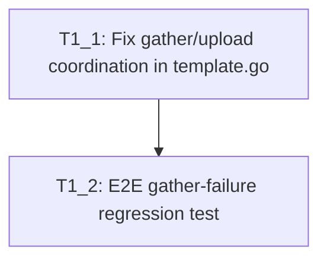

# Execution Backlog
**Bug:** MG-357 — Upload/obfuscation proceeds after gather exits without success verification
**AgentRoutingMode:** PROVIDED
**ConstitutionVersion:** 1.0
**Task sizing:** min=2, max=8, consolidation_threshold=2
**SME decisions:** Defaults accepted (exit-code marker file, exit-code gate only, preserve timeout 124/137 behavior, template-only fix)

## 0. Input coverage checklist

- **RCA primary root cause** — `uploadCommand` lacks gather-success gate → **T1_1**
- **RCA contributing root cause** — `gatherCommand` masks non-timeout failures → **T1_1**
- **Bugfix-plan: write `.gather_exit` marker on shared volume** → **T1_1**
- **Bugfix-plan: upload reads marker after pgrep debounce, exits 1 on failure** → **T1_1**
- **Bugfix-plan: preserve `uploadCommandDirect` for `obfuscate.source`** → **T1_1** (unit test assertion)
- **Bugfix-plan: preserve timeout 124/137 → exit 0** → **T1_1** (unit test assertion)
- **Bugfix-plan: unit tests in `template_test.go`** → **T1_1** (co-generated)
- **Bugfix-plan: E2E gather-failure → no-upload** → **T1_2**
- **Jira AC: no upload/obfuscation on gather failure; Job/CR Failed** → **T1_1**, **T1_2**
- **Jira AC: `obfuscate.source` unchanged** → **T1_1**
- **Constitution: no API/CRD changes** → **T1_1** non-goals
- **Constitution: `make go-test` passes** → **T1_1**, **T1_2**

## 1. Task Dependency Graph (Mermaid)

## 2. Linear Execution Order (Chronological)

1. [x] T1_1 — Fix gather/upload coordination in template.go with unit tests
2. [x] T1_2 — E2E gather-failure regression test

## 3. Task Execution Manifest (table)

| Task ID | Task Title | Assigned Agent | Depends On | Parallel OK | Complexity | Risk |
|---------|-----------|---------------|-----------|------------|-----------|------|
| T1_1 | Fix gather/upload coordination in template.go with unit tests | Job Template | none | No | 5 | Med |
| T1_2 | E2E gather-failure regression test | Testing | T1_1 | No | 5 | Med |

## 4. Task Specifications (Payloads)

### Task T1_1: Fix gather/upload coordination in template.go with unit tests

- **Objective:** Ensure upload runs only after gather succeeds by fixing `gatherCommand` exit propagation and adding a gather-exit gate to `uploadCommand` using a shared-volume marker file.
- **Root cause trace:** rca-report.md §4 — missing gather-success gate in `uploadCommand` (L52); `gatherCommand` exit-code masking (L32)
- **Target file(s):**
  - `controllers/mustgather/template.go` — `gatherCommand`, `uploadCommand`
  - `controllers/mustgather/template_test.go` — co-generated unit tests
- **Non-goals / forbidden edits:**
  - No changes to `build/bin/upload` (template-only fix per SME default)
  - No API/CRD/controller logic changes
  - No output-completeness validation beyond exit-code gate
  - Do not modify `uploadCommandDirect` behavior for `obfuscate.source` mode
  - Do not hand-edit generated files (`zz_generated.*`, CRD YAML)
- **Implementation notes:**
  - **`gatherCommand`**: Add `set -o pipefail`. Capture gather exit status. Write exit code to `/must-gather/.gather_exit` on the shared output volume. For timeout codes 124/137, preserve existing behavior (log "Gather timed out", exit 0, write 0 to marker). For other non-zero statuses, `exit $status` after writing marker.
  - **`uploadCommand`**: After existing pgrep debounce loop, read `/must-gather/.gather_exit`. If file missing or exit code non-zero, log clear failure message and `exit 1` without calling `/usr/local/bin/upload`. Only invoke `/usr/local/bin/upload` when marker reads 0.
  - Preserve `uploadCommandDirect` path unchanged when `hasObfuscateSource(obfuscate)` is true.
  - Use existing shell style in `template.go` constants (embedded `\n` scripts).
- **Acceptance criteria:**
  - `gatherCommand` includes `pipefail` and propagates non-zero exit for non-timeout failures
  - Timeout 124/137 still results in gather container exit 0 (documented in test comment)
  - `uploadCommand` checks `.gather_exit` before `/usr/local/bin/upload`
  - `uploadCommandDirect` unchanged for source mode (existing `template_test.go` pattern at ~L933)
  - Unit tests assert command string contents for success gate, pipefail, and source-mode exemption
  - `make go-test` passes
  - `make lint` passes
- **Downstream handoff:** Updated `template.go` and `template_test.go` ready for E2E validation in T1_2

### Task T1_2: E2E gather-failure regression test

- **Objective:** Add end-to-end coverage proving gather failure prevents upload/obfuscation and Job/CR report failure.
- **Root cause trace:** rca-report.md §6 Regression Prevention; bug-report.md repro CR (`gatherSpec.command` exit 1)
- **Target file(s):**
  - `test/e2e/must_gather_operator_test.go`
- **Non-goals / forbidden edits:**
  - No production code changes (tests only)
  - Do not require live SFTP — test obfuscation-enabled gather failure path or PVC-only variant if SFTP unavailable in e2e env
- **Implementation notes:**
  - Follow existing e2e patterns in `must_gather_operator_test.go` (Ginkgo, envtest/cluster assumptions per `MGO_TESTING.md`)
  - Apply MustGather CR with `obfuscate.enabled: true` and `gatherSpec.command` that exits non-zero (from bug-report.md)
  - Assert: Job reaches failed state; upload container logs do not show obfuscation/upload success; MustGather CR status `Failed`
  - Mark test skipped or document cluster prerequisite if e2e env lacks required setup
  - **Evidence: PARTIAL** — live cluster was unavailable during repro-verification; e2e may need cluster access
- **Acceptance criteria:**
  - New e2e test case covers gather-failure → no-upload path
  - Test passes in CI e2e environment or is appropriately skipped with clear message
  - `make test-e2e` passes (or skipped tests documented)
  - Existing e2e tests unaffected
- **Downstream handoff:** Full regression coverage for `/opsx-apply` implementation verification

## 5. Orchestration notes (non-code)

#### Retry Boundaries
- **T1_1** can be retried independently — isolated to `template.go` and unit tests
- **T1_2** depends on T1_1 completion; retry after T1_1 merges

#### Merge Conflict Hotspots
- `controllers/mustgather/template.go` — high churn area; rebase carefully
- `controllers/mustgather/template_test.go` — parallel edits likely during T1_1
- Do not touch `zz_generated.deepcopy.go`, CRD YAML, or `vendor/`

#### Open Questions Requiring SME Before Execution
- None — all bugfix-plan §8 questions resolved via SME defaults (Enter → defaults)
